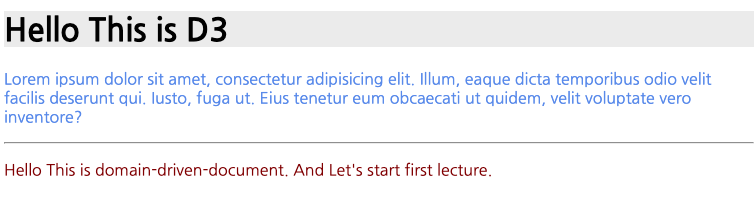
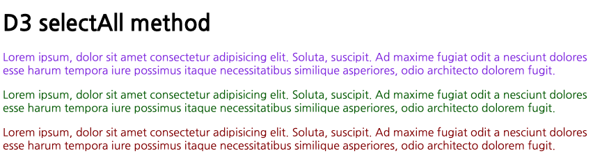

# DOM Selection

D3에서 가장 먼저 알아야할 부분이 바로 DOM Selection 입니다.

DOM 은 HTML 이 구성하는 트리형 문서 구조를 말합니다. (Document Object Model)를 선택한다는 것은 우리가 그려야할 대상 SVG 엘리먼트 혹은 D3 구성 요소들을 선택할때 매우 유용합니다.

## DOM Selector

DOM 을 선택할 수 있는 방법에는 2가지 메소드를 지원합니다.

| Method                    | Description                                                            |
| ------------------------- | ---------------------------------------------------------------------- |
| `select(css-selector)`    | HTML 문서중에서 css-selector 에 매칭되는 첫번째 엘리먼트를 반환합니다. |
| `selectAll(css-selector)` | HTML 문서중에서 css-selector 에 매칭되는 모든 엘리먼트를 반환합니다.   |

## 사용 예제

### d3.select('css-selector')

css-selector 에 해당하는 첫번째 엘리먼트를 반환한다.

```javascript
<!DOCTYPE html>
<html lang="en">
	<head>
		<meta charset="UTF-8" />
		<meta name="viewport" content="width=device-width, initial-scale=1.0" />
		<meta http-equiv="X-UA-Compatible" content="ie=edge" />
		<title>Selector Sample</title>
		<script src="https://d3js.org/d3.v5.min.js"></script>
	</head>
	<body>
		<div class="myFirstElement">
			<h1>Hello This is D3</h1>
			<p>
				Lorem ipsum dolor sit amet, consectetur adipisicing elit. Illum,
				eaque dicta temporibus odio velit facilis deserunt qui. Iusto,
				fuga ut. Eius tenetur eum obcaecati ut quidem, velit voluptate
				vero inventore?
			</p>
			<hr />
			<p id="par">
				Hello This is domain-driven-document. And Let's start first
				lecture.
			</p>
		</div>
	</body>
	<script>
		var h1elem = d3.select("h1");
		h1elem.style("background", "#eee");

		d3.select("p").style("color", "CornflowerBlue ");
		d3.select("#par").style("color", "DarkRed");
	</script>
</html>

```

위 코드를 확인해 보겠습니다.

`d3.select("h1")` 을 통해서 h1 엘리먼트를 추출합니다. 만약 h1 여러개라면 첫번째 엘리먼트만 반환됩니다.

`h1elem.style("background", "#eee");` 를 수행했으니 타이틀 백그라운가 회색으로 변합니다.

`d3.select("p").style("color", "ConflowerBlue");` 를 수행한것은 p 엘리먼트들 중 첫번째 엘리먼트를 밝은 파란색으로 표시합니다.

`d3.select("#par").style("color", "DarkRed");` 를 통해서 p 엘리먼트의 ID 가 #par 인 것을 찾아서 속성을 어두운 붉은색으로 표시합니다.

### 결과보기



### d3.selectAll('css-selector')

selectAll 은 DOM 엘리먼트에서 css-selector 에 해당하는 모든 엘리먼트 목록을 반환합니다.

이 모든 엘리먼트에 원하는 스타일을 넣거나, d3 오퍼레이션 및 속성을 추가할 수 있습니다.

```javascript
<!DOCTYPE html>
<html lang="en">
	<head>
		<meta charset="UTF-8" />
		<meta name="viewport" content="width=device-width, initial-scale=1.0" />
		<meta http-equiv="X-UA-Compatible" content="ie=edge" />
		<title>SelectAll</title>
		<script src="https://d3js.org/d3.v5.min.js"></script>
	</head>
	<body>
		<div id="selectall">
			<h1>D3 selectAll method</h1>

			<p>
				Lorem ipsum, dolor sit amet consectetur adipisicing elit.
				Soluta, suscipit. Ad maxime fugiat odit a nesciunt dolores esse
				harum tempora iure possimus itaque necessitatibus similique
				asperiores, odio architecto dolorem fugit.
			</p>
			<p>
				Lorem ipsum, dolor sit amet consectetur adipisicing elit.
				Soluta, suscipit. Ad maxime fugiat odit a nesciunt dolores esse
				harum tempora iure possimus itaque necessitatibus similique
				asperiores, odio architecto dolorem fugit.
			</p>
			<p>
				Lorem ipsum, dolor sit amet consectetur adipisicing elit.
				Soluta, suscipit. Ad maxime fugiat odit a nesciunt dolores esse
				harum tempora iure possimus itaque necessitatibus similique
				asperiores, odio architecto dolorem fugit.
			</p>
		</div>
	</body>
	<script>
		const colors = ["#8A2BE2", "#006400", "#8B0000"];
		var pemel = d3.selectAll("p");

		// console.log(pemel);
		pemel.style("color", function(d, i) {
			console.log(d, ":", i, " >> ", colors[i], this);
			return colors[i];
		});
	</script>
</html>

```

위 코드에서 살펴볼 내용은 dom 내에 p 엘리먼트가 3개가 있다는 것입니다 .
우리는 이 3개에 엘리먼트에 각각 색상을 다르게 지정해 보도록 하겠습니다.

`const colors = ["#8A2BE2", "#006400", "#8B0000"];` 로 색상 3가지를 준비합니다.

그리고 `var pemel = d3.selectAll("p")` 를 통해서 p 엘리먼트를 모두 셀렉트 해 옵니다.

셀렉트해온 엘리먼트에 스타일을 아래와 같이 적용하였습니다.

```
		pemel.style("color", function(d, i) {
			console.log(d, ":", i, " >> ", colors[i], this);
			return colors[i];
		})
```

style 은 각 엘리먼트에 스타일을 주입 시킨다는 의미입니다.

그리고 `style("스타일속성", "값")` 을 해주면 고정된 값이 모든 엘리먼트에 설정이 됩니다.

만약 함수가 주어진다면 2개의 파라미터를 받는 함수가 올 수 있습니다 .

`function(d, i) {...}` 의 형태이며, 이 d는 데이터, i 는 엘리먼트의 인덱스입니다.

각 p 엘리먼트에 지정된 색상을 설정해준다면, 반환값으로 colors[i] 가 되면 되겠죠?

### 결과보기



## 결론

지금까지 select 와 selectAll 을 확인해 보았습니다.

d3의 기본은 select 입니다. d3는 내부 자체적으로 돔 구조를 가지므로 셀렉터는 HTML DOM 접근과 svg 엘리먼트내 하위 엘리먼트 접근에 반드시 알아야하는 기본 입니다.
