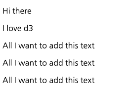

# D3 에서 DOM 알아보기.

지난번 연재 내용에서 D3 에서 DOM 셀렉션을 알아보았습니다.

돔을 선택한 후 DOM 에 신규 엘리먼트를 추가하거나, 속성값을 추가하거나, css 스타일도 먹일 수 있습니다.

## DOM 관리 기능

-   element 삽입, 제거
-   엘리먼트에 attribute 추가
-   엘리먼트 프로퍼티 추가하기
-   css styling 하기
-   html 코드 삽입

위와 같이 DOM 에 접근하고, DOM 을 관리할 수 있습니다.

이제부터 D3가 가진 DOM 기능들을 알아보고 어떻게 운용할 수 있는지 살펴보도록 하겠습니다.

## DOM Manipulating Sample

### append() 를 이용하여 엘리먼트 추가하기

`selection.append(name)`

append 는 셀렉팅된 엘리먼트 마지막에 신규 엘리먼트를 추가합니다.

그리고 신규 엘리먼트가 추가된 새로운 엘리먼트를 반환합니다.

새로운 엘리먼트는 현재 엘리먼트의 데이터를 상속 받습니다.

```
	<body>
		<div>
			<p>Hi there</p>
		</div>
	</body>
	<script>
		d3.select("body div")
			.append("p")
			.text("I love d3");
	</script>
```

위 코드를 보면 body 엘리먼트 하위 div 엘리먼트를 찾아서 반환합니다.
그리고 append() 메소드를 통해서 신규 엘리먼트인 p 를 추가하고 자식 엘리먼트로 `I love d3` 텍스트 엘리먼트를 추가합니다.

DOM 은 어떻게 보일까요?

```
<div>
    <p>Hi there</p>
    <p>I love d3</p>
</div>
```

### selectAll 에 append 이용하기.

selectAll으로 여러 엘리먼트에 append 를 추가하면 어떻게 될까요?

```
<body>
    ...
    <div class="all">
        <p></p>
    </div>
    <div class="all">
        <p></p>
    </div>
    <div class="all">
        <p></p>
    </div>
</body>
<script>
    ...

    d3.selectAll(".all")
        .append("p")
        .text("All I want to add this text");
</script>
```

짐작할 수 있듯이 우리는 .all 라는 클래스내의 div 전체를 모두 셀렉션 합니다.
그리고 "p" 엘리먼트를 추가합니다. 그리고 p 엘리먼트 하위에 `All I want to add this text` 를 추가하게 됩니다.

DOM 은 어떻게 될까요?

```
<div class="all">
    <p></p>
    <p>All I want to add this text</p>
</div>
<div class="all">
    <p></p>
    <p>All I want to add this text</p>
</div>
<div class="all">
    <p></p>
    <p>All I want to add this text</p>
</div>
```

기대한대로 각 엘리먼트에 동일한 문구를 추가해서 3개의 라인이 출력됩니다.



### insert 이용하기.

`selection.attr(name[, before])`

이번에는 insert 를 알아보겠습니다.

insert 가 append와 다른점은 append 는 매치되는 엘리먼트 내에 마지막에 추가되는 것인반면, insert 는 매치되는 엘리먼트 이전에 엘리먼트를 추가하는 것이 다릅니다.

이때 매치되는 엘리먼트 이전에 엘리먼트를 추가하기 위해서는 before 속성이 있어야합니다.

```
<body>
    <div>
        <p>Hi there</p>
    </div>
</body>
<script>
    d3.select("body div")
        // .insert("p", ":first-child")  // Hi there 이전에 추가
        // .insert("p", "p")             // Hi there 이전에 추가
        .insert("p")                     // Hi there 다음에 추가
        .text("I love d3");
</script>
```

body div 엘리먼트를 선택합니다.
그리고 선택된 엘리먼트에 "p" 엘리먼트를 추가하게 됩니다. 그런데 ":first-child" 라고 before 속성을 추가했기 때문에 이전 엘리먼트에 위치됩니다.

만약 이 속성이 존재하지 않는다면 마지막 엘리먼트로 추가 되빈다. append 와 동일하게 됩니다.

### text 이용하기.

`selection.text([value])`

text 메소드는 위에서 확인한것과 같이 선택된 엘리먼트 child 에 텍스트를 추가합니다.

자식 엘리먼트로 텍스트를 추가하는 의미이며 동작 방식은 이미 확인했습니다.

### attr 이용하기.

`selection.attr(name[, value])`

attr 은 엘리먼트에 속성을 설정하도록 합니다.

HTML 에서는 지정된 속성 이외에도 사용자가 설정한 속성도 추가할 수 있기 때문에 attr 이름만 지정한다면 해당 이름으로 속성값이 추가 됩니다.

value 값이 상수라면 선택된 모든 엘리먼트에 동일한 attribute 값이 추가됩니다.

만약 value 값이 function 이라면, 함수의 처리 결과가 세팅됩니다. 함수는 d(데이터)와 i(인덱스) 를 받을 수 있으며, 함수내에서 this 는 엘리먼트 하나하나가 됩니다.

```
<body>
    <div>
        <div id="content" style="background:#eee;">
            <p>Hello I'll show you attr method.</p>
            <input type="checkbox" /> Check Please
        </div>
    </div>
</body>
<script>
    d3.select("#content input").attr("checked", "");
</script>
```

위 코드를 확인해보면, id 값이 content 라는 엘리먼트 하위에 input 박스를 선택합니다.
그리고 checked 속성을 지정하여 체크박스가 선택되도록 만들어 줍니다.

DOM 을 살펴보겠습니다.

```
<div id="content" style="background:#eee;">
    <p>Hello I'll show you attr method.</p>
    <input type="checkbox" checked=""> Check Please
</div>
```

이렇게 attr 을 이용하면 해당 엘리먼트에 속성을 추가할 수 있습니다.
d3에서 가장 많이 사용하는 메소드라고 할 수 있습니다.

### classed 이용하기.

`selection.classed(name[, value])`

D3에서 dom selection 은 매우 중요한 요소라고 했습니다.

우리가 원하는 엘리먼트를 추가하고, 해당 엘리먼트를 셀렉션 하기 쉽게 하려면 class 속성을 잘 지정하는 것이 중요합니다.

그럴때 사용하는 것이 classes 입니다.

메소드 설명에서 본바와 같이 value 에 정적 값이 올 수 있고, 함수가 올 수 있습니다.
함수가 온다면 (d, i) 의 형태이며, d는 데이터, i는 인덱스, this 는 해당 엘리먼트 요소를 나타냅니다.

```
<style>
    .my-selector {
        background: #55aa22;
        font-size: 400;
    }
    .my-selector2 {
        background: #22aabb;
        font-size: 800;
    }
</style>
<body>
    <div>
        <div id="content">
            <p>Paragraph 01</p>
            <p>Paragraph 02</p>
            <p>Paragraph 03</p>
        </div>
        <div id="content2">
            <p class="my-selector2">Toggle 01</p>
            <p>Toggle 02</p>
        </div>
    </div>
</body>
<script>
    // 클래스를 추가한다.
    d3.selectAll("#content p").classed("my-selector", true);

    // 클래스를 제거한다.
    d3.selectAll("#content p").classed("my-selector", false);

    // 클래스 속성을 토글링한다.
    var content2 = d3.selectAll("#content2 p");
    content2.classed("my-selector2", function(d, i) {
        return !content2.classed("my-selector2");
    });
</script>
```

classed 에서는 첫번째 파라미터는 클래스 이름, 두번째 파라미터는 true/false 값이 올 수 있습니다.

true 라면 클래스를 지정하고, false 라면 지정된 클래스가 존재한다면 제거합니다.

위 샘플 예제를 실행해보면 Paragraph 01 ~ 03 모두 클래스가 지정되지 않음을 볼 수 있습니다.

true 로 클래스 설정을 했다가, 다시 false 로 제거를 했으니까요.

마지막 코드는 토글링 하는 샘플입니다. Toggle 01 은 클래스가 지정되었다가 토글링되면서 제거가 되고, Toggle 02는 클래스 지정이 안되어 있다가, 다시 지정되여 스타일이 먹힌것을 볼 수 있습니다.

### style 로 css 스타일 먹이기

`selection.style(name[, value[, priority]])`

차트 역시 이쁜것이 보기도 좋고, 인식하기도 쉽습니다. 그러므로 css 는 차트를 예쁘게 꾸며주기 위한 매우 중요한 요소라고 할 수 있습니다.

스타일링을 이용하여 css 를 직접 엘리먼트에 지정해 줄 수 있습니다.

이전 classed 에서 본 것과 같이 css 를 미리 지정해두고 클래스를 설정해서 스타일을 먹일 수도 있고, style 을 이용하여 각 엘리먼트 단위의 스타일을 먹일 수 있습니다.

```
<body>
    <svg width="200" height="200">
        <circle cx="100" cy="100" r="80"></circle>
        <circle id="second" cx="100" cy="100" r="50"></circle>
    </svg>
</body>
<script>
    d3.select("circle").style("fill", "#22aa99");

    const color = {
        yellow: "yellow"
    };

    d3.select("#second").style("fill", color.yellow);
</script>
```

위 코드는 2개의 원을 그리고, 큰원에는 녹색에 가까운색으로 칠하고, 가운데 작은 원은 노란색으로 지정합니다.


### property 이용하기.

`selection.property(name[, value])`

property 는 엘리먼트의 속성 property 값을 업데이트 할때 사용합니다.

```
<body>
    <div>
        <div id="content" style="background:#eee;">
            <p>Hello I'll show you attr method.</p>
            <input type="checkbox" checked /> Check Please
        </div>
    </div>
</body>
<script>
    d3.select("#content input").property("checked", false);
</script>
```

위 예제는 체크박스에 checked 된 설정을 uncheck 하는 예제입니다.
샘플을 실행해보면 체크박스가 해제되어 있는것을 볼 수 있습니다.

### html 이용하기.

`selection.html([value])`

html 은 D3 선택된 엘리먼트의 자식 엘리먼트를 html 으로 교체합니다.

```
<body>
    <div>
        <div id="content" style="background:#eee;">
            <p>Hello I'll show you attr method.</p>
        </div>
    </div>
</body>
<script>
    d3.select("#content").html(
        '<div id="container"><input type="checkbox" checked/></div>'
    );
</script>
```

DOM 을 확인해보겠습니다.

```
<div>
    <div id="content" style="background:#eee;">
        <div id="container">
            <input type="checkbox" checked="">
        </div>
    </div>
</div>
```

보시는바와 같이 content 내부에 체크박스를 포함하는 container 라는 div 가 추가되어 있습니다.

### remove 로 엘리먼트 제거하기.

`selection.remove()`

선택된 엘리먼트를 제거합니다. 

```
	<body>
		<div>
			<div id="content" style="background:#eee;">
				<p>Hello I'll show you attr method.</p>
			</div>
		</div>
	</body>
	<script>
		d3.select("#content p").remove();
	</script>
```

DOM 을 사펴보겠습니다. 
```
<div>
    <div id="content" style="background:#eee;">
        
    </div>
</div>
```

보시는 바와같이 p 엘리먼트가 사라졌습니다. 

## 결론 

D3 는 DOM 엘리먼트를 셀렉션하고, 엘리먼트의 속성을 부여함으로 SVG내의 차트와 이미지들을 그려줍니다 .
지금까지 제시한 것이 DOM 관리의 기본적인 메소드이며, 앞으로도 이 메소드들을 자주 이용하게 될 것입니다. 
