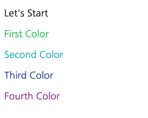
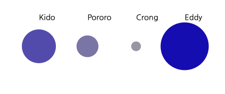

# D3 Data JOIN

D3가 Data Driven Document 라는것을 보아도 Data를 다루는 방법이 매우 중요합니다.

이번에는 Data JOIN 데해서 알아보겠습니다.

## Data Join

D3 에서 사용하는 데이터는 JSON 을 기본으로 이용합니다.

### 텍스트별 색상 지정하기.

텍스트와 색상을 가진 JSON 객체가 있고, 이들 텍스트를 출력하는 예제입니다.

```
<body>
    <div class="container">
        <p></p>
        <p></p>
        <p></p>
        <p></p>
        <p></p>
    </div>
</body>
<script>
    var textData = [
        { text: "Let's Start", color: "black" },
        { text: "First Color", color: "rgba(51,203,90,1)" },
        { text: "Second Color", color: "rgba(16,179,191,1)" },
        { text: "Third Color", color: "rgba(17,54,157,1)" },
        { text: "Fourth Color", color: "rgba(141,17,157,1)" },
        { text: "End.", color: "black" }
    ];

    d3.select(".container")
        .selectAll("p")
        .data(textData)
        .text(function(d) {
            return d.text;
        })
        .style("color", function(d) {
            return d.color;
        });
</script>
```

위 예제를 살펴보면, div.container 내부에 p 엘리먼트가 5개가 있습니다.

그리고 textData 는 6개의 Object 를 가지고 있습니다.

`text` 를 출력하고, 각 텍스트에 색상을 지정하고 있습니다.

### 결과보기



결과화면과 같이 우리가 지정한 5개의 엘리먼트에만 텍스트가 출력하고, 마지막 End. 는 출력되지 않습니다.
이유는 셀렉션을 위 html 코드내에서 p 를 모두 셀렉션하였고, 그 개수가 5개이기 때문에 해당 부분에만 적용이 되었기 때문입니다.

### 점수별 집중도 표시하기.

이번에는 학생별 점수를 기록하고, 점수가 높으면 짙은색상, 낮으면 옅은 색상을 출력하도록 해보겠습니다.

```
<body>
    <svg width="800" height="200">
        <circle></circle>
        <circle></circle>
        <circle></circle>
        <circle></circle>
        <text></text>
        <text></text>
        <text></text>
        <text></text>
    </svg>
</body>
<script>
    var score = [
        { name: "Kido", score: 70 },
        { name: "Pororo", score: 45 },
        { name: "Crong", score: 20 },
        { name: "Eddy", score: 99 }
    ];

    var colors = [
        "rgba(161,160,172,1)",
        "rgba(132,128,174,1)",
        "rgba(94,85,181,1)",
        "rgba(23,7,184,1)"
    ];

    d3.select("svg")
        .selectAll("circle")
        .data(score)
        .attr("cx", function(d, i) {
            return (i + 1) * 100;
        })
        .attr("cy", 100)
        .attr("r", function(d) {
            return d.score / 2;
        })
        .style("fill", function(d) {
            if (d.score >= 0 && d.score < 25) return colors[0];
            else if (d.score >= 25 && d.score < 50) return colors[1];
            else if (d.score >= 50 && d.score < 75) return colors[2];
            else if (d.score >= 75 && d.score <= 100) return colors[3];
        });

    d3.select("svg")
        .selectAll("text")
        .data(score)
        .attr("x", function(d, i) {
            return (i + 1) * 100;
        })
        .attr("y", 45)
        .text(function(d) {
            return d.name;
        });
</script>
```

위 코드를 잠시 살펴 보겠습니다.

score 변수에는 각 학생들의 이름과 점수가 있습니다.

우리는 점수를 4 구간으로 나누어 표시하려고 합니다.

0 ~ 25점, 25 ~ 50점, 50 ~ 75점, 75 ~ 100점 으로 구간을 나누어 color 로 지정한 색상으로 표시할 에정입니다.

`circle` 엘리먼트를 4개 추가하였고, 그 아래 `text` 엘리먼트 4개를 추가하였습니다.

svg 에서 circle 은 원을 그려주고, text 는 텍스트를 표시합니다.

circle 엘리먼트 각각의 cx 위치는 인덱스 \* 100pixel 거리에 표시합니다. 높이는 100pixel 떨어진 거리입니다.

```
.attr("cx", function(d, i) {
    return (i + 1) * 100;
})
.attr("cy", 100)
```

그리고 r 엘리먼트는 radius 로 반지름 크기를 성적의 절반으로 잡아주었습니다.

```
.attr("r", function(d) {
    return d.score / 2;
})
```

fill 속성을 통해서 원형의 색상을 지정할 수 있는데 이때 4분위를 위해서 반환값을 색상 인덱스로 반환하고 있습니다.

```
.style("fill", function(d) {
    if (d.score >= 0 && d.score < 25) return colors[0];
    else if (d.score >= 25 && d.score < 50) return colors[1];
    else if (d.score >= 50 && d.score < 75) return colors[2];
    else if (d.score >= 75 && d.score <= 100) return colors[3];
})
```

텍스트 출력은 각 학생의 이름을 나타내도록 하겠습니다.

x좌표와 y 좌표로 텍스트 위치를 다음과 같이 잡아주었습니다.

```
.attr("x", function(d, i) {
    return (i + 1) * 100;
})
.attr("y", 45)
```

텍스트 내용은 다음과 같이 지정해 주었습니다 .

```
.text(function(d) {
    return d.name;
})
```

중요한 것은 각 셀렉션에 데이터를 조인하기 위해서

`selection.data(data)` 을 통해서 데이터를 주입하였고, 각 속성마다 function(d, i) 를 통해서 데이터와 인덱스에 접근하는 것입니다.

data() 메소드를 통해서 데이터를 주입하고 나면, 각 셀렉션한 엘리먼트 개수와 데이터를 1:1 매칭시켜가면서 원하는 속성을 지정할 수 있습니다.

셀렉션한 개수만큼만 노출하기 때문에 남은 데이터는 화면에 노출되지 않고 그냥 스킵 됩니다.

### 결과보기



## 결론

지금까지 데이터를 조인하고, 노출하는 것을 시도해 보았습니다.

데이터는 JSON 으로 지정하고, 배열을 통해서 순회하는 구조로 데이터를 조인합니다.

조인된 데이터는 각 함수를 통해서 셀렉션된 함수를 순회하면서, 데이터도 함게 조회할 수 있도록 해주는 것도 알아보았습니다.
