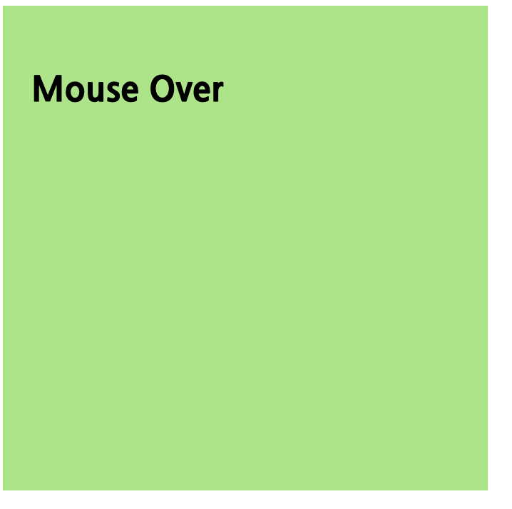
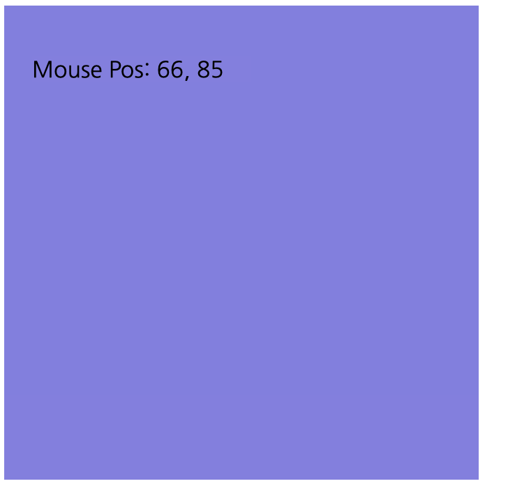

# D3 Event

정적인 데이터를 보여주는 것보다, 마우스가 특정 객체에 Over 되었을때 화면이 보여진다면, 더욱더 다이나믹 할 것입니다.

사용자도 원하는 마우스 커서를 가져다 대면, 데이터를 보여준다거나, 줌인 아웃등을 통해서 데이터, 차트등을 확대, 축소 할 수 이쓸 것입니다.

이번에는 D3의 이벤트에 대해서 알아보겠습니다.

## D3 Event 시작하기.

D3에서 이벤트의 가장 기본은 Selection 으로 부터 시작합니다.

`# selection.on(typenames[, listener[, options]]) <>`

on 메소드를 통해서 이벤트 리스너를 등록할 수 있습니다.

-   typenames 는 이벤트를 나타내는 문자열입니다. (mouseover, click, ubmit 등 다양한 이벤트가 올 수 있으며 D3는 [DOM Event](https://developer.mozilla.org/en-US/docs/Web/Events#Standard_events) 를 지원합니다.
-   listener 은 이벤트가 발생했을때 수행되는 함수를 나타냅니다. 이벤트가 발생하면 어떠한 일을 해야하는지 코드를 작성하면 될것입니다.
-   options 는 이벤트리스너의 특성을 나타내는 값이 올 수 있습니다. [dom.eventListener](https://developer.mozilla.org/en-US/docs/Web/API/EventTarget/addEventListener)

## mouse over and out event

```
		<style>
			.rect {
				width: 300px;
				height: 300px;
				background: rgba(133, 124, 228, 1);
				font-weight: 300;
				padding: 20px;
			}

			.rectw {
				width: 300px;
				height: 300px;
				background: rgba(157, 230, 125, 1);
				font-weight: 900;
				font-size: 1.5rem;
				padding: 20px;
			}
		</style>
	</head>
	<body>
		<div class="rect">
			<p>Mouse Out</p>
		</div>
	</body>
	<script>
		d3.select("div")
			.on("mouseover", handleMouseOver)
			.on("mouseout", handleMouseOut);

		function handleMouseOver(d, i) {
			d3.select(this)
				.classed("rectw", true)
				.classed("rect", false);

			d3.select("p").text("Mouse Over");
		}

		function handleMouseOut(d, i) {
			d3.select(this)
				.classed("rectw", false)
				.classed("rect", true);
			d3.select("p").text("Mouse Out");
		}
	</script>
```

위 Sample은 마우스 오버/아웃에 대한 이벤트 샘플입니다.

div 에 class="rect" 인 엘리먼트를 하나 만듭니다.
해당 스타일을 헤더에 잡아 주었습니다.

div 엘리먼트를 셀렉션 하였습니다. 그리고 위 샘플과 같이 on 메소드를 통해서 이벤트 리스너를 타입에 맞게 설정합니다.

```
d3.select("div")
    .on("mouseover", handleMouseOver)
    .on("mouseout", handleMouseOut);
```

mouseover 이벤트 타입에 대해서는 handleMouseOver 메소드를 등록하고,
mouseout 이벤트 타임에 대해서는 handleMouseOut 메소드를 등록했습니다.

### handleMouseOver

```
function handleMouseOver(d, i) {
    d3.select(this)
        .classed("rectw", true)
        .classed("rect", false);

    d3.select("p").text("Mouse Over");
}
```

이벤트 리스너 함수는 d, i 파라미터를 갖게 됩니다. 그리고 내부적으로 this 는 해당 이벤트가 발생된 엘리먼트를 나타냅니다.

우리는 select(this) 를 통해서 이벤트가 적용된 엘리먼트를 셀렉션 했습니다.
그리고 classed를 통해서 rectw 는 true 했으므로 클래스 등록, rect 는 클래스 제거를 수행했습니다.

그리고 d3.select("P") 를 셀렉션해서 마우스 오버라는 글자라 나타나도록 했습니다.



### handleMouseOut

이 메소드는 정확히 handleMouseOver 와 반대로 동작합니다.


## event 메소드 이용하기

event 에서 중요한 포인트중에 하나는 이벤트 자체를 컨트롤 하는 것입니다.

마우스 이벤트라면 해당 마우스의 포인트 위치를 출력할 수도 있을 것이고, 혹은 해당 위치를 통해서 값을 뽑아내는 것도 필요할 수 있습니다.

```
    <style>
    .rect {
            width: 300px;
            height: 300px;
            background: rgba(133, 124, 228, 1);
            font-weight: 300;
            padding: 20px;
        }
    </style>
</head>
<body>
    <div class="rect">
        <p>Mouse Pos</p>
    </div>
</body>
<script>
    d3.select("div").on("mousemove", handleMouseMove);

    function handleMouseMove(d, i) {
        var x = d3.event.pageX;
        var y = d3.event.pageY;

        d3.select("p").text("Mouse Pos: " + x + ", " + y);
    }
</script>
```

위 샘플은 이전과 거의 유사합니다.

타입으로는 mousemove 으로하고, handleMouseMove 라는 이벤트 리스너를 받았습니다

d3.event 라고 하면, 현재 발생한 이벤트 정보를 획득합니다.

우리는 마우스의 위치를 출력할 것이므로 event.pageX, event.pageY 를 가져왔습니다.

그리고 택스트를 엘리먼트에 마우스 위치를 출력합니다.



# 결론

지금까지 d3 이벤트에 대해서 간단히 알아 보았습니다. 
d3는 DOM 에서 지원하는 이벤트를 모두 지원하며 해당 정보는 아래 경로에서 찾을 수 있습니다.

[DOM Event](https://developer.mozilla.org/en-US/docs/Web/Events#Standard_events)

[dom.eventListener](https://developer.mozilla.org/en-US/docs/Web/API/EventTarget/addEventListener)
