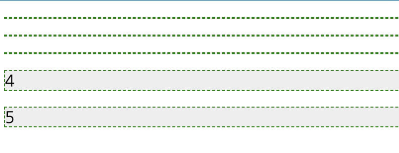
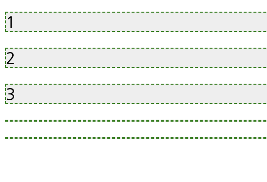
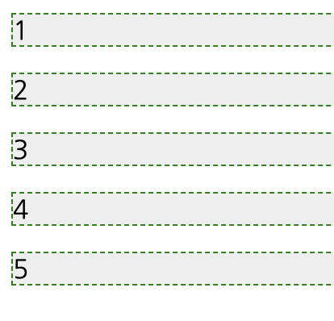
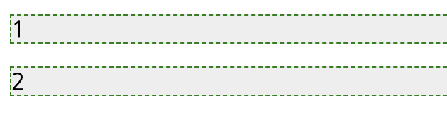

# Enter and Exit

DATA JOIN 은 D3에서 데이터를 인제스천 하는 방법에 대한 기초적인 내용이었습니다.

이미 준비된 데이터를 d3에 주입하고, 그래프를 그려줄 수 있고, DOM 처리를 수행할 수 있습니다.

그러나, 이전 예제에서는 정해진 dom element 내에서만 작업을 할 수 있었고, 데이터가 엘리먼트보다 적거나, 많아도 오류는 나지 않지만 원하는 데이터를 모두 그려줄 수 없는 문제가 있었습니다.

Enter 와 Exit 를 이용하면, 데이터의 변경에 따라 DOM 을 동적으로 변경시켜 줄 수 있는 기능을 제공할 수 있습니다.

## Enter

우선 enter 에 대해서 알아보겠습니다.

enter는 dom 엘리먼트가 join 된이후 데이터보다 작은 값을 얼마나 더 추가해야하는지를 계산하고, 엘리먼트를 추가할 수 있도록 해줍니다.

```
	<body>
		<div id="container">
			<p></p>
			<p></p>
			<p></p>
		</div>
	</body>
	<script>
		var datas = [1, 2, 3, 4, 5];

		d3.select("#container")
			.selectAll("p")
			.data(datas)
			.enter()
			.append("p")
			.text(function(d) {
				return d;
			});
	</script>
```

위 예제에서 우선 container ID 를 가진 div 하위에 p 엘리먼트 3개가 이미 존재합니다.

그런데 하위 datas 를 보면 1 ~ 5까지 5개의 요소를 가지고 있습니다.

여기서 엘레먼트를 셀렉션하고, data 를 통해서 데이터를 조인합니다. 그리고 enter를 이용하였습니다.

이렇게 되면 3개의 p 엘리먼트에서 추가로 필요한 엘리먼트가 2개라는 것을 인지하게 됩니다.

이후 append 를 이용하여 엘리먼트를 추가합니다.

### 결과 확인하기:



보시는바와 같이 먼저 있던 엘리먼트는 반영이 안되었습니다.
그리고 2개의 엘리먼트가 모자랐으니 append('p') 를 통해서 2개의 p 엘리먼트가 추가 되었고, 값은 4, 5 가 할당된 것음 보았습니다.

어떤가요? 기대와 다른가요?

그러나 이 동작은 사실 정확한 스펙이 따른 동작입니다. enter 를 통해서 추가되어야할 엘리먼트가 계산된 것입니다.

## Exit

만약 이미 지정된 엘리먼트보다 조인된 데이터가 작을때에는 어떻게 있던 제거되어야할 엘리먼트를 어떻게 알 수 있을까요?

이럴때 이용하는 것이 exit 입니다.

```
	<body>
		<div id="container">
			<p></p>
			<p></p>
			<p></p>
		</div>
	</body>
	<script>
		var datas = [1];

		d3.select("#container")
			.selectAll("p")
			.data(datas)
			.exit()
			.remove();
	</script>
```

달라진 부분은 스크립트 부분입니다.

데이터가 1개의 요소만 존재합니다. 그리고 동일하게 셀렉션 하였습니다.

셀렉션한 엘리먼트는 3개입니다. 조인된 데이터는 1개이죠? 데이터와 셀렉션된 엘리먼트가 맞지 않는 개수는 2개입니다.

우리는 이때 remove 를 통해서 필요없는 엘리먼틀르 제거해 줄 수 있습니다.

위 결과를 보면 하나의 p 엘리먼트만 존재하는 dom 이 생성되었을 것입니다.

## 의도에 맞게 데이터 출력하기.

우리의 의도는 첫번째 예제에서 비어있는 p 엘리먼트에 데이터를 채워 넣고 싶습습니다.

그런데 첫번째 예제로는 그러한 작업이 안됩니다. 어떻게 해야할까요?

### 첫번재 시도

```
		<style>
			#container p {
				background: #eee;
				border: dashed 1px green;
			}
		</style>
	</head>
	<body>
		<div id="container">
			<p></p>
			<p></p>
			<p></p>
		</div>
	</body>
	<script>
		var datas = [1, 2, 3, 4, 5];

		var joinedData = d3
			.select("#container")
			.selectAll("p")
			.data(datas);

		joinedData.enter().append("p");

		joinedData.text(function(d, i) {
            console.log("data: ", d, ":", i);
			return d;
		});
	</script>
```

이 예제는 일단 데이터를 조인먼저 합니다.

그리고 enter() 를 통해서 모자란 부분만 엘리먼트를 추가하고,

다시 셀렉션되고 조인된 부분을 반복하면서 text 를 추가해 주었습니다.

결과는 어떻게 되었을까요?



원하는 결과는 아닙니다.

그런데 가만히 생각해보면 동작은 맞습니다.
우리가 추가한 것은 일단 조인된 엘리먼트지만 처음 셀렉션된 3개의 p 엘리먼트에만 텍스트를 추가한 것입니다.

enter.append() 는 초기 선택된 셀렉션에 포함되지 않았다는 의미이죠.

### 두번째 시도 merge

위 결과를 보면서 생각해볼 것은 그렇다면 셀렉션에 추가된 엘리먼트도 포함될 수 있도록 해주면 정상 동작할 것이라는 짐작이 갑니다.

```
	<body>
		<div id="container">
			<p></p>
			<p></p>
			<p></p>
		</div>
	</body>
	<script>
		var datas = [1, 2, 3, 4, 5];

		var joinedData = d3
			.select("#container")
			.selectAll("p")
			.data(datas);

		joinedData
			.enter()
			.append("p")
			.merge(joinedData)
			.text(function(d, i) {
				console.log("data: ", d, ":", i);
				return d;
			});
	</script>
```

달라진점은 merge 를 통해서 셀렉션된 엘리먼트를 추가된 엘리먼트와 함께 조인을 했다는 것입니다.
그리고 바로 text 룰 추가해 주었습니다.

결과를 확인해볼까요?



이제 우리가 원하는 결과를 얻었습니다.

## 전체 조합하기.

이제 그럼 데이터에 따라서 줄어들고 늘어나는 작업을 할 수 있도록 마지막으로 한번 작업해 보겠습니다.

```
	<body>
		<div id="container">
			<p></p>
			<p></p>
			<p></p>
		</div>
	</body>
	<script>
		var datas = [1, 2];

		var joinedData = d3
			.select("#container")
			.selectAll("p")
			.data(datas);

		joinedData
			.enter()
			.append("p")
			.merge(joinedData)
			.text(function(d, i) {
				console.log("data: ", d, ":", i);
				return d;
			});

		joinedData.exit().remove();
	</script>
```

코드에서 변한부분은 `joinedData.exit().remove();` 부분입니다. 

즉, 엘리먼트의 변화에서 조인된 데이터가 셀렉션보다 작을때 제거만 해주었습니다. 

데이터를 `var datas = [1, 2];` 로 해 주었을때 다음과 같이 변했습니다. 

우리가 원한 결과입니다. 



# 결론

지금가지 데이터의 변화에 따라 DOM 엘리먼트를 어떻게 변화 시키는지 알아보았습니다. 

enter 를 통해서 부족한 엘리먼트를 계산해내었고

append 를 통해서 엘리먼트를 부족분만큼 추가했습니다. 

exit 를 통해서 엘리먼트가 제거되어야할 개수를 계산했고

remove 를 통해서 엘리먼트를 제거하였습니다. 

이제부터 d3 를 이용해서 차트를 그려주는 기초적인 요소를 넘어서 다이나믹하게 변화하는 데이터를 차트나 dom 엘리먼트에 표현할 수 있게 되었습니다. 


