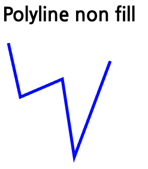
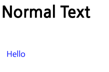

# SVG(Scalable Vecotr Graphics)

SVG 는 벡터 기반의 그래픽을 지원하는 엘리먼트 입니다.

그래픽이라고 하면 2가지가 존재합니다.

-   Raster: 고정된 이미지 영역에서 픽셀을 이용하여 하나의 그림을 나타냅니다. 점을 찍어서 그림을 그린다고 생각하면 될것 입니다 .
-   Vector: 벡터는 점과 점을 연결하는 수학식을 이용하여 도형을 그리거나, 그림을 그립니다.

HTML5 에서는 2가지 엘리먼트를 제공합니다.

-   Canvas: Raster 이미지를 표현하기 위한 그림판 영역입니다. 확대/축소를 하게 되면 이미지가 깨지는 단점이 있습니다. 그래거 Canvas 는 redraw 를 통해서 이미지를 다시 그려주는 방식을 이용하여 이를 해결합니다.
-   SVG: Vector 이미지를 그려주기 위한 그림판 영역입니다. 확대/축소를 해도 다시그리지 하지 않고도, 부드럽게 그림이 그려집니다.


image from [https://www.seekacreative.co.nz/resources/vector-vs-raster-files](https://www.seekacreative.co.nz/resources/vector-vs-raster-files)

## Rectangle

이제 사각형 부터 그려봅시다.

```
	<body>
		<div>
			<h1>Default Rectangle</h1>
			<svg width="400" height="200">
				<rect
					x="10"
					y="10"
					width="300"
					height="100"
					style="fill:blue;stroke-width:3;stroke:black"
				></rect>
			</svg>
		</div>
		<div>
			<h1>Rectangle Opacity</h1>
			<svg width="400" height="200">
				<rect
					x="10"
					y="10"
					width="300"
					height="100"
					style="fill:blue;stroke-width:3;stroke:black;fill-opacity:0.2;stroke-opacity: 0.8"
				></rect>
			</svg>
		</div>
		<div>
			<h1>Rounded Rectangle</h1>
			<svg width="400" height="200">
				<rect
					x="10"
					y="10"
					rx="10"
					ry="10"
					width="300"
					height="100"
					style="fill:blue;stroke-width:3;stroke:black;fill-opacity:0.2;stroke-opacity: 0.8"
				></rect>
			</svg>
		</div>
	</body>
```

### 기본 사각형

기본 사각형은 `<rect>` 로 수행됩니다.

사각형은 시작위치를 나타내는 x, y 속성을 가지고 해당 위치로 이동합니다.

그리고 width, height 속성을 이용하여 가로, 높이를 그려줍니다.

svg 엘리먼트는 스타일을 이용하여 색상, 테두리 두께 등을 지정할 수 있으며 우리는 다음과 같은 속성을 지정해 주었습니다.

```
style="
    fill:blue;
    stroke-width:3;
    stroke:black"
```

-   fill:blue 채우기 색상은 파란색으로 지정하였습니다. rgb(0, 0, 255) 로 지정하면 동일한 결과가 나타납니다.
-   stroke-width:3 은 테두리의 굵기를 의미합니다.
-   stroke:black 은 테두리 색상을 검은색으로 지정해 주었습니다.


### 투명처리된 색상을 가진 사각형

위 사각형에서 추가적인 스타일만 지정하면 투명한 색상을 지닌 사각형을 그려줄 수 있습니다.

```
style="
    fill:blue;
    stroke-width:3;
    stroke:black;
    fill-opacity:0.2;
    stroke-opacity: 0.8"
```

-   fill-opacity: 0.2 로 불투명도 20% 지정하였습니다. 불투명도 값은 (0 ~ 1) 까지 값이 올 수 있습니다.
-   stroke-opacity: 0.8 로 색상 뷸투명도를 80% 로 지정하였습니다. 불투명도 값은 (0 ~ 1) 까지 값이 올 수 있습니다.


### 라운드 처리된 사각형 그리기

사각형의 모양에 대한 특성은 attribute 를 통해서 지정할 수 있습니다.

```
			<svg width="400" height="200">
				<rect
					x="10"
					y="10"
					rx="10"
					ry="10"
					width="300"
					height="100"
					style="fill:blue;stroke-width:3;stroke:black;fill-opacity:0.2;stroke-opacity: 0.8"
				></rect>
			</svg>
```

달라진 부분은 rx 값과 ry 값입니다. 이는 각 모퉁이의 radius 를 10으로 하자 라는 의미입니다.
이 값이 커질 수록 더 둥근 사각형이 됩니다.


## Circle and Ellipse

Circle 은 정원을 그려주는 도구입니다. 차트를 그릴때 원은 매우 다양한 용도로 사용됩니다.

Ellipse 은 타원을 그려주는 도구입니다.

`<circle>` 엘리먼트를 이용하여 정원을 그려줄 수 있습니다.

`<ellipse>` 를 이용하여 타원을 그려줄 수 있습니다.

```
	<body>
		<div>
			<h1>Normal Circle</h1>
			<svg width="400" height="300">
				<circle
					cx="100"
					cy="60"
					r="50"
					stroke="black"
					stroke-width="3"
					fill="rgba(171,211,153,1)"
				></circle>
			</svg>
		</div>
		<div>
			<h1>Normal Ellipse</h1>
			<svg width="400" height="400">
				<ellipse
					cx="150"
					cy="80"
					rx="100"
					ry="50"
					stroke="black"
					stroke-width="3"
					fill="rgba(171,211,153,1)"
				></ellipse>
			</svg>
		</div>
	</body>
```

### circle

circle 엘리먼트를 이용하고, x, y 의 위치를 지정하기 위해서 cx, cy 를 설정합니다.
그러면 원의 중심위치를 지정할 수 있습니다.

r 은 radius 로 원의 반지름을 설정할 수 있습니다.

이전 rect 예제와는 조금다르게, stroke, storke-width 값을 어트리뷰터르 지정하였습니다.

둘다 같은 결과가 나옵니다. 원하는 스타일링을 style 을 이용하거나, attr 로 이용하면 됩니다 .


## Line

Line 은 시작과 끝점을 잇는 직선을 그려줍니다.

```
	<body>
		<div>
			<h1>Normal Line</h1>
			<svg width="300" height="300">
				<line
					x1="10"
					y1="10"
					x2="280"
					y2="280"
					stroke="green"
					stroke-width="2.5"
				></line>
			</svg>
		</div>
		<div>
			<h1>Dashed Line</h1>
			<svg width="300" height="300">
				<line
					x1="10"
					y1="10"
					x2="280"
					y2="280"
					stroke="green"
					stroke-width="2.5"
					stroke-dasharray="5,5"
				></line>
			</svg>
		</div>
		<div>
			<h1>Dash Dot Dash Line</h1>
			<svg width="300" height="300">
				<line
					x1="10"
					y1="10"
					x2="280"
					y2="280"
					stroke="green"
					stroke-width="2.5"
					stroke-dasharray="20,5,5,5"
				></line>
			</svg>
		</div>
	</body>
```

`<line>` 엘리먼트를 이용하여 화면에 직선을 그려줄 수 있습니다 .

-   x1: 시작 x 위치
-   y1: 시작 y 위치
-   x2: 끝 x 위치
-   y2: 끝 y 위치

나머지 stroke 와 stroke-width 는 이전에 보았던 내용과 동일합니다 .


### Dash 라인 그려주기

dash 라인을 그려주는 것은 stroke-dasharray 를 이용할 수 있습니다.

-   stroke-dasharray="5,5" 을 이용하면 처음 5만큼 라인을 그리고, 5만큼 공백을 넣는 패턴으로 그려줍니다.


### Dash Dot Dash 라인 그려주기

이번에는 조금 복잡한 패턴을 그려 봅시다. 동일하게 stroke-dasharray 를 이용하면 됩니다.

-   stroke-dasharray="20,5,5,5" 을 이용하면 처음에는 20만큼 라인을 그리고 5만큼 공백, 다시 5만큼 그리고 5 공백 패턴으로 그려줍니다 .


## Polygon and Polyline

폴리곤, 폴리라인은 여러개의 선들을 이용하여 다각형을 그려주거나, 라인을 그려주는 방법입니다.

```
	<body>
		<div>
			<h1>Polygon</h1>
			<svg width="500" height="210">
				<polygon
					points="10, 10 100, 200 200, 180 200, 50"
					style="fill:blue;stroke:red;stroke-width:1"
				></polygon>
			</svg>
		</div>
		<div>
			<h1>Polygon Star</h1>
			<svg width="500" height="210">
				<polygon
					points="100,10 40,198 190,78 10,78 160,198"
					style="fill:blue;stroke:red;stroke-width:5;fill-rule:nonzero;"
				/>
			</svg>
			<h4>
				This Sample from
				https://www.w3schools.com/graphics/svg_polygon.asp
			</h4>
		</div>
		<div>
			<h1>Polygon Star EvenOdd</h1>
			<svg width="500" height="210">
				<polygon
					points="100,10 40,198 190,78 10,78 160,198"
					style="fill:blue;stroke:red;stroke-width:5;fill-rule:evenodd;"
				/>
			</svg>
			<h4>
				This Sample from
				https://www.w3schools.com/graphics/svg_polygon.asp
			</h4>
		</div>
		<div>
			<h1>Polyline non fill</h1>
			<svg width="500" height="210">
				<polyline
					points="10,10 30,100 100,70 120,200 180,40"
					style="fill:none;stroke:blue;stroke-width:5;"
				/>
			</svg>
		</div>
		<div>
			<h1>Polyline fill</h1>
			<svg width="500" height="210">
				<polyline
					points="10,10 30,100 100,70 120,200 180,40"
					style="fill:brown;stroke:blue;stroke-width:5;"
				/>
			</svg>
		</div>
	</body>
```

### 기본 폴리곤 그리기

`<polygon>` 을 이용하여 기본 폴리곤을 그릴 수 있습니다.

-   points: 들은 x1, y1, 공백 x2, y2, 공백 ... xn, yn 으로 값이 들어 올 수 있습니다.

폴리곤은 마지막 점과 시작 점이 선으로 연결이 됩니다. 그래서 다각형이 그려집니다.


### 폴리곤 별 그리기

폴리곤을 이용하여 별을 그려보겠습니다. 이 예제는 [Sample](https://www.w3schools.com/graphics/svg_polygon.asp) 가져 왔습니다.

-   fill-rule:nonzero 이 설정은 하나의 점에서 무핸대로 선을 뻗었을때 특정 점이 폴리곤 내부라면 0이 아니며, 폴리곤을 벗어난 것이라면 0이 됩니다. 즉 이 설정은 폴리곤 내부라면 모두 색상이 칠해진다는 의미로 해석하면 됩니다.


### 폴리곤 가운데 공백 별 그리기

폴리곤 별에서 가운데 공백인 별을 그려보겠습니다.
스타일 설정을 단지 다음과 같이 하면 됩니다 .

-   fill-rule:evenodd 이 설정은 홀수 이면 폴리곤 내부이고, 짝수이면 외부라고 설정합니다. 즉 홀수인경우만 색상을 칠하는 것입니다.


### 폴리라인 그리기

폴리라인은 여러개의 선을 이어서 선을 그려줍니다.

선을 그릴때 시작에서 끝점까지 선을 이어봤을때 폴리곤 안쪽이라면 색상을 치래줍니다. 그래서 다음과 같이 스타일을 지정하면 폴리라인 내부의 면을 칠하지 않습니다.

-   fill:none 면의 색상을 칠하지 않습니다.



### 폴리라인 면색상 칠하기

-   fill:brown 은 면의 색상을 갈색으로 칠해줍니다.


## Path

이제는 d3 에서 가장 많이 사용하는 Path 에 대해서 알아보겠습니다.

path 는 기본적으로 다음 명령들을 지정해 줄 수 있습니다.

-   M: 특정 위치로 이동합니다.
-   L: 라인을 그려줍니다.
-   H: 수평 라인을 그려줍니다.
-   V: 수직 라인을 그려줍니다.
-   C: 커브를 그립니다.
-   S: 부드러운 커브를 그려줍니다.
-   Q: 이차함수 베지어 커브를 그려줍니다.
-   T: 부드러운 이차함수 베지어 커브를 그려줍니다.
-   A: 타원의 아크를 그려줍니다.
-   Z: 패스의 끝을 나타냅니다.

```
	<body>
		<div>
			<h1>Normal Line</h1>
			<svg height="400" width="450">
				<path
					id="lineAB"
					d="M 100 350 l 150 -300"
					stroke="red"
					stroke-width="3"
					fill="none"
				/>
				<path
					id="lineBC"
					d="M 250 50 l 150 300"
					stroke="red"
					stroke-width="3"
					fill="none"
				/>
				<path
					d="M 175 200 l 150 0"
					stroke="green"
					stroke-width="3"
					fill="none"
				/>
				<path
					d="M 100 350 q 150 -300 300 0"
					stroke="blue"
					stroke-width="5"
					fill="none"
				/>
				<!-- Mark relevant points -->
				<g stroke="black" stroke-width="3" fill="black">
					<circle id="pointA" cx="100" cy="350" r="3" />
					<circle id="pointB" cx="250" cy="50" r="3" />
					<circle id="pointC" cx="400" cy="350" r="3" />
				</g>
				<!-- Label the points -->
				<g
					font-size="30"
					font-family="sans-serif"
					fill="black"
					stroke="none"
					text-anchor="middle"
				>
					<text x="100" y="350" dx="-30">A</text>
					<text x="250" y="50" dy="-10">B</text>
					<text x="400" y="350" dx="30">C</text>
				</g>
			</svg>
			<h4>
				This sample from https://www.w3schools.com/graphics/svg_path.asp
			</h4>
		</div>
	</body>
```

Path 가 왜 가장 많이 사용하는지 알 수 있는 에제입니다.

사실 대부분의 도형은 Path 로 그려줄 수 있습니다.

```
				<path
					id="lineAB"
					d="M 100 350 l 150 -300"
					stroke="red"
					stroke-width="3"
					fill="none"
				/>
```

이 샘플을 보면 100, 350 위치로 이동합니다. 거기서 150 -300 으로 라인을 그려줍니다.

```
				<path
					d="M 100 350 q 150 -300 300 0"
					stroke="blue"
					stroke-width="5"
					fill="none"
				/>
```

이 샘플을 보면 위치를 100, 350 으로 이동하고나서, 이차함수 베지어 커브를 그려줍니다. q 150 -300 300 0 에 따라 그림을 그려줍니다 .
자세한 내용은 다음을 참조하세요 (https://developer.mozilla.org/en-US/docs/Web/SVG/Attribute/d)


## Text

Text 역시 d3 에서 가장 많이 사용하는 엘리먼트중에 하나입니다.

```
	<body>
		<div>
			<h1>Normal Text</h1>
			<svg width="400" height="100">
				<text x="10" y="50" fill="blue">Hello</text>
			</svg>
		</div>
		<div>
			<h1>Text tspan</h1>
			<svg width="400" height="100">
				<text x="10" y="50" fill="blue">
					Hello
					<tspan font-weight="bold" fill="red">
						T-hub
					</tspan>
				</text>
			</svg>
		</div>
		<div>
			<h1>Text Path</h1>
			<svg width="400" height="400">
				<path
					id="textline"
					d="M 20 200 q 150 -300 300 0"
					fill="transparent"
				/>
				<text>
					<textpath
						xmlns:xlink="http://www.w3.org/1999/xlink"
						xlink:href="#textline"
					>
						Hello T-hub. Celebrate your reborn!!!. See you~~
					</textpath>
				</text>
			</svg>
		</div>
	</body>
```

### text 출력하기. 

text 엘리먼트를 이용하여 텍스트를 출력할 수 있습니다. 좌표를 지정하고 엘리먼트 차일드로 텍스트를 추가할 수 있습니다. 

- x: 시작의 x좌표를 지정합니다. 
- y: 시작의 y좌표를 지정합니다. 



### 텍스트의 서브 속성 추가하기

동일한 문장에 텍스트 속성을 다양하게 주고 싶을때 tspan 엘리먼트를 이용하여 서브 텍스트를 추가할 수 있스니다. 

```
				<text x="10" y="50" fill="blue">
					Hello
					<tspan font-weight="bold" fill="red">
						T-hub
					</tspan>
				</text>
```

위 예제와 같이 tspan 을 이용하고 글자 색상을 빨강으로 지정하였습니다. 


### path 따라 텍스트를 이쁘게 출력하기. 

텍스트를 path 라인을 따라 출력할 수 있습니다. 

```
				<path
					id="textline"
					d="M 20 200 q 150 -300 300 0"
					fill="transparent"
				/>
				<text>
					<textpath
						xmlns:xlink="http://www.w3.org/1999/xlink"
						xlink:href="#textline"
					>
						Hello T-hub. Celebrate your reborn!!!. See you~~
					</textpath>
				</text>
```

위 결과와 같이 경로를 우선 지정합니다. 
이 예제는 path 예제에서 아치 모양을 그려주는 것으로 q 를 통해 이차함수로 아치를 그렸습니다. 

textpath 엘리먼트를 이용하여 경로를 지정해줍니다. 

xmlns:xlink="http://www.w3.org/1999/xlink" 는 고정입니다. 

xlink:href 를 통해서 패스를 지정해주면 글자가 패스라인을 따르 출력이 됩니다. 

