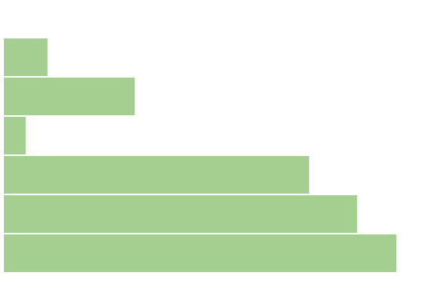
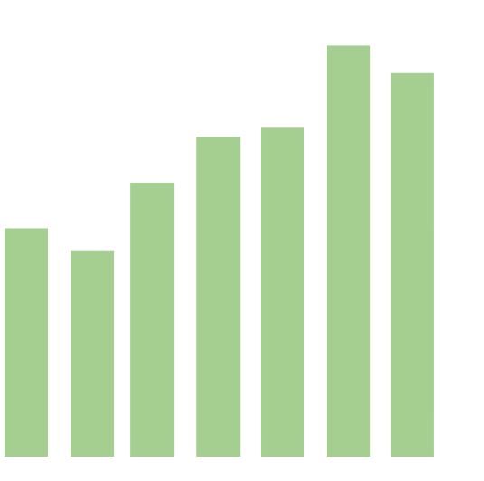

# Scale

d3에서 중요한 또하나의 값은 Scale 이라고 할 수 있습니다.

실제 데이터는 매우 큰 값들이 올 수 있으며, 그 값들을 고정된 화면 영역에 표현하는 것은 쉽지 않습니다.

적절한 축적에 따라서 데이터를 화면 영역으로 변경 매핑이 될 수 있도록 일관된 수식으로 변환을 해야합니다.

이러한 일을 해 주는 것이 Scale 입니다.

D3 에서는 다음과 같은 Scale 범주와 기능을 제공하고 있습니다.

## Scale Category

### Continuous

연속적인 데이터를 처리할 수 있습니다.

-   d3.scaleLinear(): 연속적인 리니어 스케일을 지정한다. 이것은 입력 데이터를 특정 출력 범위로 지정한다.
-   d3.scaleIdentity(): 리니어 스케일을 생성한다. 이것은 입력데이터와 출력데이터가 같은 경우 사용
-   d3.scaleTime(): 리니어 스케일을 생성하며, 입력 데이터가 날짜에 따라 스케일링 한다.
-   d3.scaleLog(): 로그 스케일링을 수행한다.
-   d3.scaleSqrt(): 스퀘어 루트 스케일 지정
-   d3.scalePow(): 지수 스케일

### Sequential

시퀀셜 스케일은 특정 값의 범위를 일련하게 분리한다.

-   d3.scaleSequential(): 순차 스케일을 생성하며, 출력 범위가 고정된 인터폴레이션 함수인경우 사용한다.

### Quantize:

리니어스케일과 유사하지만 연속 스케일이 아닌 이산값을 이용한 스케일링을 합니다.

-   d3.scaleQuantize(): 연속적인 입력을 특정 세그먼트화 하여 스케일링 합니다.

### Quantile:

연속적인 입력값을 특정 분위수에 매핑을 수행합니다.

-   d3.scaleQuantile(): 분위수 스케일링을 위한 스케일링을 생성합니다.

### Threshold:

임계값 스테일은 분연속적인 값에 대한 도메인의 특정 서브 세트 매핑을 할 수 있으며, 나머지는 Quantize 와 유사합니다. 특정 임계값 세트를 기반으로 분할매핑 됩니다.

-   d3.scaleThreshold(): 스케일을 생성하며, 임의의 입력 데이터를 별개의 출력 범위로 매핑합니다.

### Ordinal Scales:

연속적인 스케일과는 다르게, ordinal scale 는 이산적인 도메인과 범위를 가집니다.
예를 들어 지정된 색상 셋들 목록에 매핑하는 작업을 수행합니다.

-   d3.scaleOrdinal(): 오디널 스케일을 생성합니다.

### Band:

ordinal 스케일과 유사합니다. 그라나 출력 range는 연속값이나 숫자가 될 수 있습니다.

-   d3.scaleBand(): 밴드 스케일로 이것은 서수 스케일과 같은 스케일이다. 출력 범위는 연속적이고, 숫자이다.

### Point

포인트 스케일들은 0으로 고정된 밴드위스를 가지며 band scale 의 변형이다.
포인트 스케일들은 일반적으로 스캐터 플롯에서 이용된다. 포인트 스케일의 알 수 없는 값은 항상 정의되지 않습니다.

-   d3.scalePoint(): 포인트 스케일 생성하기.

## scaleLinear 이용하여 바차트 만들기

```
	<script>
		var data = [100, 200, 400, 150, 800, 910, 1000];

		var width = 500,
			height = 500,
			margin = 20,
			barWidth = 50;

		var xScale = d3
			.scaleLinear()
			.domain([d3.min(data), d3.max(data)])
			.range([0, width]);

		var svg = d3
			.select("body")
			.append("svg")
			.attr("width", width)
			.attr("height", height);

		var g = svg.append("g");

		g.selectAll("rect")
			.data(data)
			.enter()
			.append("rect")
			.attr("x", function(d, i) {
				return 0;
			})
			.attr("y", function(d, i) {
				return (i + 1) * barWidth;
			})
			.attr("width", function(d, i) {
				return xScale(d);
			})
			.attr("height", function(d, i) {
				return barWidth - 2;
			})
			.style("fill", "rgba(173,213,155,1)");
	</script>
```

위 소스에서 확인할 수 있는것과 같이 d3.scaleLinear() 를 이용하여 생성하였습니다.

domain 의 경우는 데이터의 최소/최대 값을 설정하였습니다. 즉, 도메인이라는 것은 데이터의 실제 값의 범위를 나타냅니다.

우리는 데이터가 어떻게 들어올 수 없기 때문에 d3.min / d3.max 를 이용하여 실제 값을 기준으로 설정했습니다.

range 의 경우에는 화면에 표시할 영역의 크기입니다.



이미지에서 보시는 바와 같이 넓이가 500, 높이가 500인 영역에 데이터를 표시하고 있습니다. 

## scaleTime 이용하기. 

이번에는 시간 값을 이용하여 스케일링을 수행하는 예제를 살펴 보겠습니다. 

```
	<script>
		var data = [
			{ time: "2019-01-01", score: 50 },
			{ time: "2019-02-01", score: 45 },
			{ time: "2019-03-01", score: 60 },
			{ time: "2019-04-01", score: 70 },
			{ time: "2019-05-01", score: 72 },
			{ time: "2019-06-01", score: 90 },
			{ time: "2019-07-01", score: 84 },
			{ time: "2019-08-01", score: 99 }
		];

		var width = 500,
			height = 500,
			margin = 20,
			barWidth = 50;

		var timeScale = d3
			.scaleTime()
			.domain([
				d3.min(data, d => new Date(d.time)),
				d3.max(data, d => new Date(d.time))
			])
			.range([0, width]);

		var yScale = d3
			.scaleLinear()
			.domain([d3.max(data, d => d.score), 0])
			.range([0, height]);

		var svg = d3
			.select("body")
			.append("svg")
			.attr("width", width)
			.attr("height", height);

		var g = svg.append("g");

		g.selectAll("rect")
			.data(data)
			.enter()
			.append("rect")
			.attr("x", function(d, i) {
				return timeScale(new Date(d.time));
			})
			.attr("y", function(d, i) {
				return yScale(d.score);
			})
			.attr("width", function(d, i) {
				return barWidth - 2;
			})
			.attr("height", function(d, i) {
				return height - yScale(d.score);
			})
			.style("fill", "rgba(173,213,155,1)");
	</script>
```

위 예제는 우선 날짜와 스코어 점수를 가진 객체 배열을 가진 데이터가 제공됩니다. 

위 데이터중에서 시간의 최대/최소 값을 이용하여 scaleTime 의 도메인으로 지정하였습니다. 

그리고 다음으로 range 값으로 화면 넓이를 지정했습니다. 

다음으로 수직 바 차트를 만들것이기 때문에 yScale 값을 scaleLinear 을 이용하여 구했습니다. 

domain 이 최대값이 먼저오고, 최소값이 range 의 끝 값입니다. 

이것은 우리가 일반적으로 차트를 그릴때 아래부터 위로 증가되는 차트를 그리기 때문에 이렇게 도메인과 range 를 거꾸로 매핑하였습니다. 

그리고 이전 예제와 동일하게 바를 그려줍니다. 

x 값은 시간값에 따라서 결정이 되기 대문에 timeScale(new Date(d.time)) 을 통해서 날짜값을 화면 좌표로 변환했습니다. 

```
			.attr("x", function(d, i) {
				return timeScale(new Date(d.time));
			})
```

width 값은 일단 barWidth - 2 값으로 고정하였습니다. 

```
			.attr("y", function(d, i) {
				return yScale(d.score);
			})
```

y 값은 데이터 각각의 스코어 값이기 때문에 yScale 을 이용하여 구합니다. 

```
			.attr("width", function(d, i) {
				return barWidth - 2;
			})
```

height 값은 y 값 시작시점부터, yScale 의 값만큼 height 에서 빼주면 남은 높이가 나옵니다. 

```
			.attr("height", function(d, i) {
				return height - yScale(d.score);
			})
```



시간축을 이용한 바차트가 만들어 졌습니다. 


# 결론

지금까지 스케일을 이용한 차트를 만들어 보았습니다. 

차트에서 스케일을 적용하면, 동적으로 화면의 크기가 변경될때, 이질감 없이 화면을 그려줄 수 있습니다. 

scale 다양한 데이터를 제한된 화면에 이미지를 적절히 변환 매핑시켜 줄 수 있는 방법입니다. 

본 내용은 계속해서 추가 예정입니다. 


