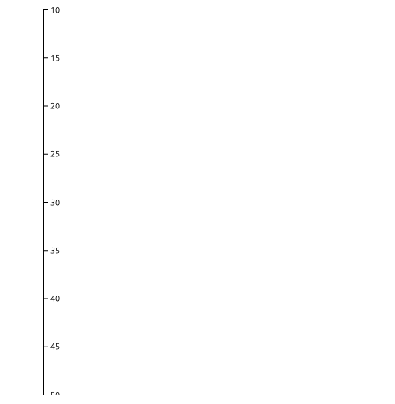

# AXES

차트에서 Axis 는 데이터를 가시화 할때 매우 중요한 부분중에 하나입니다.

차트에서 Axis 가 있어야, 현재 보는 그래프의 데이터를 확인할 수 있으며, 해당 그래프의 특정 지점이 연관된 축의 값을 파악함으로 해서 데이터 인지를 더욱 명확하게 할 수 있습니다.

특히 데이터의 최소/최대 범위를 알지 못하는 상황에서 축의 영역을 고정한다면 매우 큰 데이터가 들어왔을때 올바르게 차트를 그려줄 수 없게 됩니다.

## Axis

d3에서 축은 다음과 같은 메소드로 구현할 수 있습니다 .

-   d3.axisTop() : 상단 수평 축을 그립니다 .
-   d3.axisRight() : 오른쪽 수직 축을 그려줍니다.
-   d3.axisLeft() : 왼쪽 수직 축을 그려줍니다.
-   d3.axisBottom() : 하단 수평 축을 그립니다.

## 수평축 그리기

축을 그리기 위해서는 일단 스케일이 필요합니다.

이전 스케일 파트에서 습득한 스케일을 그대로 이용하여 축을 그려보겠습니다.

```
	<script>
		var width = 500,
			height = 500,
			margin = 10;

		var data = [10, 15, 20, 25, 30, 35, 40, 45, 50];

		var svg = d3
			.select("body")
			.append("svg")
			.attr("width", width)
			.attr("height", height);

		var scale = d3
			.scaleLinear()
			.domain([d3.min(data), d3.max(data)])
			.range([0, width - margin]);

		var xAxis = d3.axisBottom().scale(scale);
		svg.append("g").call(xAxis);
	</script>
```

위 소스를 확인해 봅시다.

우선 차트 영역의 가로, 높이, 그리고 마진값을 지정했습니다.

다음으로 data 변수에 데이터 배열을 추가 했습니다.

축을 그려주기 위해서 scale 지정하였습니다. 연속적인 데이터이기 때문에 scaleLinear() 을 생성하였습니다.

도메인의 범위는 데이터의 최소/최대 값을 지정했습니다.

범위는 0 에서 넓이 - 마진으로 설정했습니다.

마지막으로 axisBottom() 을 지정하고, scale 값을 세팅했습니다.

이제는 축을 그려줍니다. 여기서는 특이하게 call 메소드를 이용하고 있습니다.


axisBottom 은 보시는 바와 같이 축의 아래 부분에 tick 이 표시되는 방식입니다.

위 소스를 axisTop() 을 이용하여 확인해 보겠습니다.

```
	<script>
		var width = 500,
			height = 500,
			margin = 10;

		var data = [10, 15, 20, 25, 30, 35, 40, 45, 50];

		var svg = d3
			.select("body")
			.append("svg")
			.attr("width", width)
			.attr("height", height);

		var scale = d3
			.scaleLinear()
			.domain([d3.min(data), d3.max(data)])
			.range([0, width - margin]);

		var xAxis = d3.axisTop().scale(scale);
		svg.append("g")
			.attr("transform", "translate(0, 50)")
			.call(xAxis);
	</script>
```

달라진 부분을 살펴 보겠습니다. 우선 축을 그릴때 axisTop()을 이용했습니다. 틱이 상단에 그려질 것입니다.

시작 좌표가 0, 0에서 그려질 것이기 때문에 상단 틱이 표시 안됩니다. 그러므로 적당히 transform 을 이용하여 y 축 이동을 하였습니다 .


## Y축 그리기

이번에는 Y 축을 그려보겠습니다.
그리는 방법은 동일합니다.

```
	<script>
		var width = 500,
			height = 500,
			margin = 10;

		var data = [10, 15, 20, 25, 30, 35, 40, 45, 50];

		var svg = d3
			.select("body")
			.append("svg")
			.attr("width", width)
			.attr("height", height);

		var scale = d3
			.scaleLinear()
			.domain([d3.min(data), d3.max(data)])
			.range([0, width - margin]);

		var yAxis = d3.axisLeft().scale(scale);
		svg.append("g")
			.attr("transform", "translate(50, 10)")
			.call(yAxis);
	</script>
```

소스 코드 부분중 바뀐 부분은 axisLeft 를 설정한 부분과.

transform 을 가로 50, 10 입니다.


axisRight 로 한번 변경헤 보겠습니다.



일단 위처럼 4가지 방법을 이용하면 축을 그려 줄 수 있습니다.

## 일반적인 축 그려주기

이번에는 x축, y축 모두 있는 차트를 그려보겠습니다.

```
	<script>
		var width = 500,
			height = 500,
			margin = 50,
			yMargin = 10;
		var xData = [0, 100];
		var yData = [10, 15, 20, 25, 30, 35, 40, 45, 50];

		var svg = d3
			.select("body")
			.append("svg")
			.attr("width", width)
			.attr("height", height);

		var xScale = d3
			.scaleLinear()
			.domain(xData)
			.range([0, width - margin - 10]);

		var yScale = d3
			.scaleLinear()
			.domain([d3.min(yData), d3.max(yData)])
			.range([0, height - margin]);

		var xAxis = d3.axisBottom().scale(xScale);
		var yAxis = d3.axisLeft().scale(yScale);
		svg.append("g")
			.attr("transform", "translate(50, " + yMargin + ")")
			.call(yAxis);

		svg.append("g")
			.attr(
				"transform",
				"translate(50, " + (height - (margin - yMargin)) + ")"
			)
			.call(xAxis);
	</script>
```

일단 X 축과 Y축을 모두 그려주기 위해서 데이터 범위를 2개로 만들었습니다.

xData, yData 2가지 데이터를 만들었으며, 라인차트등을 그린다면 yData 가 실제 데이터가 될 것입니다.

xScale, yScale 모두 scaleLinear 로 설정했으며, 도메인과 range 를 잡아주었습니다.

x 축은 아래 표시할 것이기 때문에 axisBottom() 으로 지정했고,

y 축은 좌측에 표시할 것이기 때문에 axisLeft() 으로 지정했습니다.

그리고 차트를 화면에 적당히 맞추어 주기 위해서 transform 을 수행하여 위치를 translate 로 이동하였습니다.

여기에 추가된 "g" 엘리먼트는 실제 d3 에서 논리적인 그룹을 묶어주는 것으로 차트 축과 데이터를 논리적 그룹으로 맞추어 주는 역할을 합니다.

이에 대해서는 나중에 다시 자세히 설명을 하도록 하겠습니다.

결과를 한번 볼가요?


# 결론

차트에서 축을 그려보았습니다. 

차트 축을 그리기 위해서는 scale 을 지정해 주어야합니다. 데이터의 성격에 따라 다앙햔 축을 그려줄 수 있습니다. 

그리고 차트 위치도 상, 하, 좌, 우로 지정할 수 있는 것을 보았습니다. 
