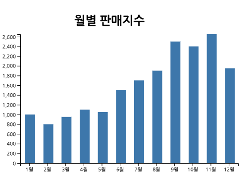

# BarChart

이번에는 BAR 차트를 그려보겠습니다.



위 차트 그림과 같이 차트를 그리기 위해서 우리가 해야할 일이 어떤것이 있는지 알아 보겠습니다. 

## 차트를 그리기 위해서 무엇이 필요한지 알아보겠습니다. 

1. 타이틀
2. 표시할 데이터 
3. x축, y축 
4. 바 차트 rect 엘리먼트 

우리는 이러한 요소들을 사용하여 차트를 그리겠습니다. 

```
	<script>
		var datas = [
			{ date: "1월", sales: 1000 },
			{ date: "2월", sales: 800 },
			{ date: "3월", sales: 950 },
			{ date: "4월", sales: 1100 },
			{ date: "5월", sales: 1050 },
			{ date: "6월", sales: 1500 },
			{ date: "7월", sales: 1700 },
			{ date: "8월", sales: 1900 },
			{ date: "9월", sales: 2500 },
			{ date: "10월", sales: 2400 },
			{ date: "11월", sales: 2650 },
			{ date: "12월", sales: 1950 }
		];

		var title = "월별 판매지수";
		var titleGap = 50;
		var margin = (margin = { top: 20, right: 20, bottom: 70, left: 40 });
		var width = 500 - margin.left - margin.right,
			height = 400 - margin.top - margin.bottom - titleGap;

		const peopleArray = Object.keys(datas).map(i => datas[i].date);
		var xScale = d3
			.scaleBand()
			.domain(peopleArray)
			.range([0, width]);
		var yScale = d3
			.scaleLinear()
			.domain([d3.max(datas, d => d.sales), 0])
			.range([0, height]);

		var svg = d3
			.select("body")
			.append("svg")
			.attr("width", width + margin.left + margin.right)
			.attr("height", height + margin.top + margin.bottom + titleGap)
			.append("g")
			.attr(
				"transform",
				"translate(" + margin.left + "," + (margin.top + titleGap) + ")"
			);

		var xAxis = d3.axisBottom().scale(xScale);

		svg.append("g")
			.attr("transform", "translate(0," + height + ")")
			.call(xAxis);

		var yAxis = d3.axisLeft().scale(yScale);
		svg.append("g")
			.call(yAxis);

		svg.selectAll("bar")
			.data(datas)
			.enter()
			.append("rect")
			.style("fill", "steelblue")
			.attr("x", function(d) {
				return xScale(d.date) + 20 / 2;
			})
			.attr("width", 20)
			.attr("y", function(d) {
				return yScale(d.sales);
			})
			.attr("height", function(d) {
				return height - yScale(d.sales);
			});

		d3.select("body svg")
			.append("g")
			.attr("transform", `translate(${width / 2} , 50)`)
			.append("text")
			.attr("font-size", 24)
			.attr("font-weight", "bold")
			.attr("text-anchor", "middle")
			.text(title);
	</script>
```

## 차트 데이터 

```
		var datas = [
			{ date: "1월", sales: 1000 },
			{ date: "2월", sales: 800 },
			{ date: "3월", sales: 950 },
			{ date: "4월", sales: 1100 },
			{ date: "5월", sales: 1050 },
			{ date: "6월", sales: 1500 },
			{ date: "7월", sales: 1700 },
			{ date: "8월", sales: 1900 },
			{ date: "9월", sales: 2500 },
			{ date: "10월", sales: 2400 },
			{ date: "11월", sales: 2650 },
			{ date: "12월", sales: 1950 }
		];
```

위 차트 데이터는 date와 sales을 포함하는 객체들의 배열로 데이터입니다. 

## 차트를 그리기 위한 기본적인 레이아웃 설정값

```
		var title = "월별 판매지수";
		var titleGap = 50;
		var margin = (margin = { top: 20, right: 20, bottom: 70, left: 40 });
		var width = 500 - margin.left - margin.right,
			height = 400 - margin.top - margin.bottom - titleGap;
```

제목, 제목을 위한 공간, 마진, 넓이, 높이 들을 가진 기본 정보를 설정했습니다. 

### 스케일 지정하기

이제 스케일을 지정하겠습니다. 

우리 데이터는 2가지 타입이 있습니다. 

가로축에는 월별 데이터를 나열합니다. 세로축에는 판매 지수 값을 나열합니다. 

월별 데이터에 대해서는 이산적인 데이터입니다. 그래서 우리는 band 스케일을 이용하겠습니다. 

월별 판매지수는 Linear 스케일을 이용하겠습니다. 

```
		const peopleArray = Object.keys(datas).map(i => datas[i].date);

		var xScale = d3
			.scaleBand()
			.domain(peopleArray)
			.range([0, width]);

		var yScale = d3
			.scaleLinear()
			.domain([d3.max(datas, d => d.sales), 0])
			.range([0, height]);
```

band 데이터를 위해서 datas내에 date 라는 데이터를 뽑아서 배열로 만듭니다. 

해당 배열을 밴드 스케일의 domain 추가하고, range [0, width] 로 지정하여 스케일링을 했습니다. 

linear 스케일은 데이터중 sales 값을 도메인에 추가하고, range 에 추가했습니다. 

### X 축 그려주기

```
		var xAxis = d3.axisBottom().scale(xScale);

		svg.append("g")
			.attr("transform", "translate(0," + height + ")")
			.call(xAxis)
```

x축은 하단에 위치할 예정입니다. 그리고 축을 지정하기 위해서 scale 에 xScale 을 추가했습니다. 

x 축을 높이값만큼 이동 시켜서 x축을 그려줍니다. 

### Y 축 그려주기

```
		var yAxis = d3.axisLeft().scale(yScale);
		svg.append("g")
			.call(yAxis);
```

y 축을 위와 같이 그려줍니다. 

### 실제 바 차트 그려주기 

```
		svg.selectAll("bar")
			.data(datas)
			.enter()
			.append("rect")
			.style("fill", "steelblue")
			.attr("x", function(d) {
				return xScale(d.date) + 20 / 2;
			})
			.attr("width", 20)
			.attr("y", function(d) {
				return yScale(d.sales);
			})
			.attr("height", function(d) {
				return height - yScale(d.sales);
			});
```

bar 차트를 선택합니다. 

그리고 rect 등에 대해서 데이터를 추가하고, rect 값을 추가합니다. 

차트 스타일은 파란식을 그려주었습니다. 

x, 넓이, y 축, 높이를 그려줍니다. 

해당 높이는 height - yScale(d.sales) 으로 해주는 것은 그림을 위에서 아래로 그려주기 땜에 높이에서 차트 데이터의 위치를 빼주면 높이가 됩니다. 

### 제목 달기

```
		d3.select("body svg")
			.append("g")
			.attr("transform", `translate(${width / 2} , 50)`)
			.append("text")
			.attr("font-size", 24)
			.attr("font-weight", "bold")
			.attr("text-anchor", "middle")
			.text(title);
```

제목을 달기 위해서 이동 시켜줍니다. 가로는 정 가운데, 그리고 상단에서 50 픽셀 이동시켰습니다. 

텍스트는 폰트 크기, 폰트 넓이를 지정했습니다. 

그리고 텍스트 표시 위치를 middle 로 해서 제목을 가운데 기준으로 잡아 주었습니다. 


# 결론

바 차트를 그려 보았습니다. 

바 차트는 데이터의 추이값을 보여주거나, 일반적인 상관 데이터를 표시해주는데 매우 유용한 차트입니다. 

svg 를 준비하고, 데이터를 표시할 적절한 스케일을 지정했습니다. 

그리고 스케일에 따른 축을 그려주고, 바를 그려주었습니다. 

마지막으로 제목을 달아서 그럴싸한 차트가 그려졌습니다. 

