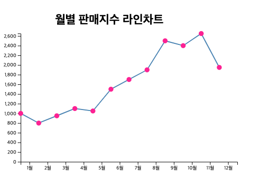
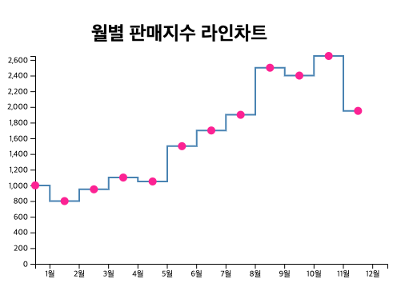
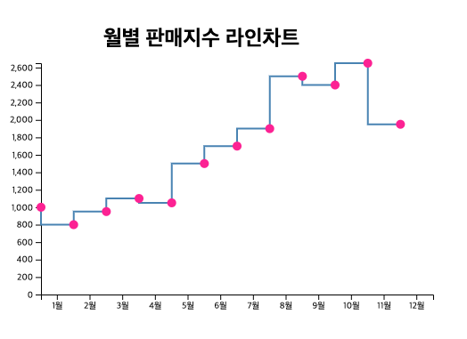
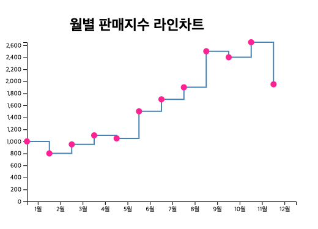
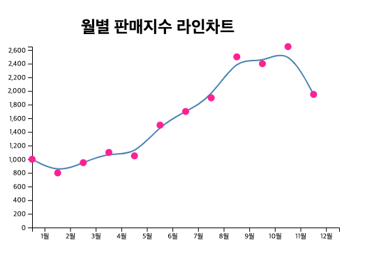
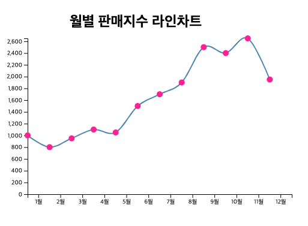
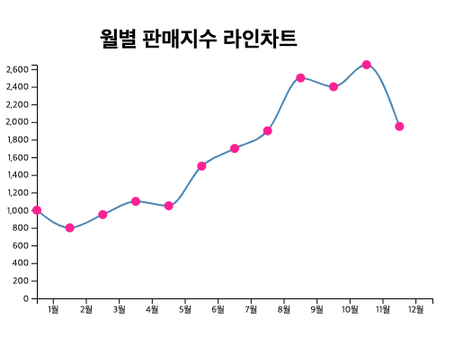
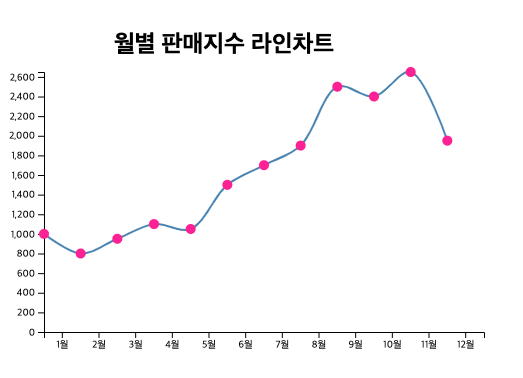

# Line Chart 

이번에는 차트 중에서 가장 많이 사용하는 라인 차트를 그려보겠습니다. 

라인 차트를 이루는 구성 요소를 알아볼께요. 

## 라인차트 구성요소 

1. 타이틀
2. 표시할 데이터: 라인차트를 그려주기 위해서는 데이터가 준비 되어야겠지요? 데이터는 월별 판매지수 그대로 이용하겠습니다 .
3. x축, y축 
4. 바 차트 line 함수
5. line 데이터를 path 를 이용하여 그려주기. 
6. 라인에 커브 속성 넣어주기 (꺽은선, 연속선) 등 표시하기

위와 같이 라인 구성요소는 바 차트와 대부분 유사하지만, 라인차트를 그려줄때 사용하는 함수는 조금 다릅니다. 

우리는 소스에서 라인차트를 좀더 명확하게 표시하기 위해서 circle 을 추가하여, 라인의 지점마다 핑크색 점을 찍어보도록 하겠습니다. 

## 라인차트 소스 

```
	<script>
		var datas = [
			{ date: "1월", sales: 1000 },
			{ date: "2월", sales: 800 },
			{ date: "3월", sales: 950 },
			{ date: "4월", sales: 1100 },
			{ date: "5월", sales: 1050 },
			{ date: "6월", sales: 1500 },
			{ date: "7월", sales: 1700 },
			{ date: "8월", sales: 1900 },
			{ date: "9월", sales: 2500 },
			{ date: "10월", sales: 2400 },
			{ date: "11월", sales: 2650 },
			{ date: "12월", sales: 1950 }
		];

		var title = "월별 판매지수 라인차트";
		var titleGap = 50;
		var margin = (margin = { top: 20, right: 20, bottom: 70, left: 40 });
		var width = 500 - margin.left - margin.right,
			height = 400 - margin.top - margin.bottom - titleGap;

		const peopleArray = Object.keys(datas).map(i => datas[i].date);
		var xScale = d3
			.scaleBand()
			.domain(peopleArray)
			.range([0, width]);
		var yScale = d3
			.scaleLinear()
			.domain([d3.max(datas, d => d.sales), 0])
			.range([0, height]);

		var svg = d3
			.select("body")
			.append("svg")
			.attr("width", width + margin.left + margin.right)
			.attr("height", height + margin.top + margin.bottom + titleGap)
			.append("g")
			.attr(
				"transform",
				"translate(" + margin.left + "," + (margin.top + titleGap) + ")"
			);

		var xAxis = d3.axisBottom().scale(xScale);

		svg.append("g")
			.attr("transform", "translate(0," + height + ")")
			.call(xAxis)

		var yAxis = d3.axisLeft().scale(yScale);
		svg.append("g")
			.call(yAxis)

		svg.append("path")
			.datum(datas)
			.attr("fill", "none")
			.attr("stroke", "steelblue")
			.attr("stroke-width", 2)
			.attr("d", d3.line()
			.x( (d, i) => xScale(d.date) )
			.y( (d, i) => yScale(d.sales) )
			// .curve(d3.curveLinear)
			// .curve(d3.curveStep)
			// .curve(d3.curveStepBefore)
			// .curve(d3.curveStepAfter)
			// .curve(d3.curveBasis)
			// .curve(d3.curveCardinal)
			// .curve(d3.curveMonotoneX)
			.curve(d3.curveCatmullRom)
			);

		svg.selectAll("circle")
			.data(datas)
			.enter()
			.append("circle")
			.attr("cx", (d) => xScale(d.date))
			.attr("cy", (d) => yScale(d.sales))
			.attr("r", 5)
			.attr("fill", "deeppink");

		d3.select("body svg")
			.append("g")
			.attr("transform", `translate(${width / 2} , 50)`)
			.append("text")
			.attr("font-size", 24)
			.attr("font-weight", "bold")
			.attr("text-anchor", "middle")
			.text(title);
	</script>
```

### 데이터 설정하기. 

```
		var datas = [
			{ date: "1월", sales: 1000 },
			{ date: "2월", sales: 800 },
			{ date: "3월", sales: 950 },
			{ date: "4월", sales: 1100 },
			{ date: "5월", sales: 1050 },
			{ date: "6월", sales: 1500 },
			{ date: "7월", sales: 1700 },
			{ date: "8월", sales: 1900 },
			{ date: "9월", sales: 2500 },
			{ date: "10월", sales: 2400 },
			{ date: "11월", sales: 2650 },
			{ date: "12월", sales: 1950 }
		];
```

라인 데이터는 위와 같습니다. 월별 판매 지수 데이터의 배열을 가집니다. 

### 차트 영역 및 레이아웃 잡기 

```
		var title = "월별 판매지수 라인차트";
		var titleGap = 50;
		var margin = (margin = { top: 20, right: 20, bottom: 70, left: 40 });
		var width = 500 - margin.left - margin.right,
			height = 400 - margin.top - margin.bottom - titleGap;
```

차트 영역중 제목, 상,하,좌,우에 대한 마진을 지정하였습니다. 

width, height 값은 마진을 각각 뺀 것으로 실제 차트의 축적을 나타냅니다. (range 를 위한 영역)

### 차트 스케일 설정하기. 

```
		const peopleArray = Object.keys(datas).map(i => datas[i].date);
		var xScale = d3
			.scaleBand()
			.domain(peopleArray)
			.range([0, width]);
		var yScale = d3
			.scaleLinear()
			.domain([d3.max(datas, d => d.sales), 0])
			.range([0, height]);
```

차트를 위한 스케일을 잡아줍니다. 

x스케일은 월 데이터를 나타내므로 밴드 스케일을 잡았습니다. 이산적인 형태의 데이터를 표시하기에 좋습니다. 

y스케일은 판매지수 데이터를 나타내고, 수치가 연속적인 값이므로 linear 스케일을 잡았습니다. 

peopleArray 는 데이터에서 날짜 영역만 뽑아서 배열로 만들었습니다. 

### svg 차트 영역 준비하기. 

```
		var svg = d3
			.select("body")
			.append("svg")
			.attr("width", width + margin.left + margin.right)
			.attr("height", height + margin.top + margin.bottom + titleGap)
			.append("g")
			.attr(
				"transform",
				"translate(" + margin.left + "," + (margin.top + titleGap) + ")"
			);
```

차트 영역을 준비 했습니다. body 요소 하위에 svg 를 추가했습니다. 

그리고 넓이, 높이를 지정하고, 차트를 그려줄 영역을 "g" 로 묶어서 특정 위치까지 띄워줍닏. (마진과 제목 영역을 남기고 이동시키는 것이지요.)

### X축 그리기

```
		var xAxis = d3.axisBottom().scale(xScale);

		svg.append("g")
			.attr("transform", "translate(0," + height + ")")
			.call(xAxis)
```

축을 그려줍니다. x 축은 바닥에 깔리기 때문에 높이먼큼 이동시켜서 축을 그려 주었습니다. 

### Y축 그리기 

```
		var yAxis = d3.axisLeft().scale(yScale);
		svg.append("g")
			.call(yAxis)
```

y축은 좌측에 출력합니다. 

### 라인차트 그려주기 

이제 라인을 그려줄 차례입니다 .

```
		svg.append("path")
			.datum(datas)
			.attr("fill", "none")
			.attr("stroke", "steelblue")
			.attr("stroke-width", 2)
			.attr("d", d3.line()
			.x( (d, i) => xScale(d.date) )
			.y( (d, i) => yScale(d.sales) )
			// .curve(d3.curveLinear)
			// .curve(d3.curveStep)
			// .curve(d3.curveStepBefore)
			// .curve(d3.curveStepAfter)
			// .curve(d3.curveBasis)
			// .curve(d3.curveCardinal)
			// .curve(d3.curveMonotoneX)
			.curve(d3.curveCatmullRom)
			);
```

라인은 path 를 이용합니다. path 에서 데이터는 datum 이라는 함수를 이용하여 적용해 줄 수 있습니다. 

그리고 fill 을 "none"으로 주어 라인 차트 영역이 채워지지 않도록 합니다. fill 이 있다면 d3 라인은 자동적으로 면적을 채워줍니다. 우리는 이 면적을 그려주지 않을 것이기에 채움 값을 none 으로 설정합니다. 

stroke 는 라인 선의 색상을 지정합니다. 여기서는 steelblue 색상으로 선을 그렸습니다. 

stroke-width 는 선의 굵기를 나타냅니다. 선의 굵기를 2로 잡았습니다. 

그리고 path 의 실제 데이터 영역은 "d" 속성값을 지정하고, d3.line() 메소드를 데이터로 넣어주는 것입니다. 

d3.line 메소드를 이용하여 x, y 값을 datum 에서 각각 뽑아내어 할당했습니다. x축은 월, y축은 월별 판매지수 입니다. 

그리고 마지막으로 curve 를 지정했습니다. 위 주석과 같이 커브 값을 지정하여 다양한 형태의 라인을 그려줄 수 있습니다. (꺾은선, 연속선, 계단형선) 등을 그려줄 수 있습니다. 

### 점 표시하기. 

각 데이터 지점을 다음 코드로 표시합니다. 

circle 엘리먼트를 추가히여 cx, cy 로 데이터 지점을 설정하고, r값으로 반지름을 지정합니다. 

색상은 fill 로 딥 핑크를 설정했습니다. 

```
		svg.selectAll("circle")
			.data(datas)
			.enter()
			.append("circle")
			.attr("cx", (d) => xScale(d.date))
			.attr("cy", (d) => yScale(d.sales))
			.attr("r", 5)
			.attr("fill", "deeppink");
```

### 제목 표시하기. 

```
		d3.select("body svg")
			.append("g")
			.attr("transform", `translate(${width / 2} , 50)`)
			.append("text")
			.attr("font-size", 24)
			.attr("font-weight", "bold")
			.attr("text-anchor", "middle")
			.text(title);
```

결과를 한번 볼까요? 



## Curve 

라인차트의 커브에 대해서 알아보겠습니다. 

### d3.curveLinear


### d3.curveStep



### d3.curveStepBefore



### d3.curveStepAfter



### d3.curveBasis

시작점, 끝점을 통과하는 각 점들내에서 입방면체내에 basis spline 을 그려줍니다. 



### d3.curveCardinal



### d3.curveMonotoneX



### d3.curveCatmullRom



위 커브 옵션에 대해서 더 자세한 정보를 확인하고자 한다면 

[curve](https://github.com/d3/d3-shape/blob/master/README.md#curves) 을 참조 하세요. 

# 결론

지금까지 d3 를 이용한 라인 차트를 그려보았습니다. 

라인 차트는 차트중에서도 추이를 살펴보거나, 상관관계를 살표볼 수 있는 가장 일반적이면서, 대표적인 차트입니다. 

차트 선의 종류도 다양하게 설정하여 어떻게 달라지는지도 살펴 보았습니다. 
