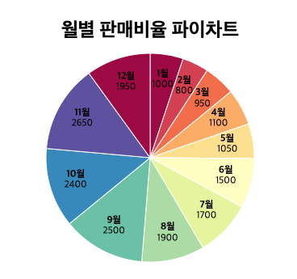
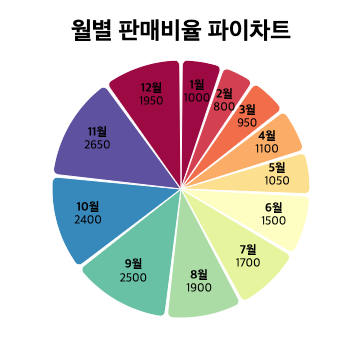
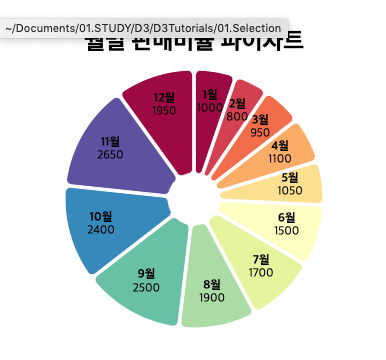

# PIE Chart and Doughnut Chart

이번에는 파이 차트를 그려보겠습니다. 

파이 차트는 데이터들이 전체 한 판의 피자에서 어느정도의 파이를 차지하는지 보여주는 차트라고 할 수 있습니다. 

즉, 파이차트는 특정 데이터가 전체 데이터에서 어느정도 차지하는지 살펴보기 위한 경우 매우 유용한 차트라고 할 수 있습니다. 

## 파이 차트를 구성 요소 

1. 타이틀
2. 표시할 데이터: 파이차트를 그려주기 위해서는 데이터가 준비 되어야겠지요? 데이터는 월별 판매지수 그대로 이용하겠습니다 .
3. 데이터를 arc 로 구성하기. (arc 는 각 데이터들의 시작, 종료 각도를 자동으로 구해줍니다.)
4. pie 차트 그리기 
5. 파이차트 데이터 표시하기
6. 파이차트, 도넛차트, 이쁘게 그리기 등.



## 파이차트 그리기 

```
  <script>
    var datas = [
      { date: "1월", sales: 1000 },
      { date: "2월", sales: 800 },
      { date: "3월", sales: 950 },
      { date: "4월", sales: 1100 },
      { date: "5월", sales: 1050 },
      { date: "6월", sales: 1500 },
      { date: "7월", sales: 1700 },
      { date: "8월", sales: 1900 },
      { date: "9월", sales: 2500 },
      { date: "10월", sales: 2400 },
      { date: "11월", sales: 2650 },
      { date: "12월", sales: 1950 }
    ];

    var title = "월별 판매비율 파이차트";
    var titleGap = 50;
    var margin = (margin = { top: 20, right: 20, bottom: 70, left: 40 });
    var width = 500 - margin.left - margin.right,
      height = 400 - margin.top - margin.bottom - titleGap;

    const peopleArray = Object.keys(datas).map(i => datas[i].date);

    var svg = d3
      .select("body")
      .append("svg")
      .attr("width", width + margin.left + margin.right)
      .attr("height", height + margin.top + margin.bottom + titleGap)
      .append("g")
      .attr(
        "transform",
        "translate(" +
          width / 2 +
          "," +
          (height / 2 + titleGap + margin.top) +
          ")"
      );

    var chartColor = d3
      .scaleOrdinal()
      .domain(peopleArray)
      .range([
        "#9e0142",
        "#d53e4f",
        "#f46d43",
        "#fdae61",
        "#fee08b",
        "#ffffbf",
        "#e6f598",
        "#abdda4",
        "#66c2a5",
        "#3288bd",
        "#5e4fa2"
      ]);

    var radius = Math.min(width, height) / 2 - 1;
    var arc = d3
      .arc()
      .innerRadius(0)
    //   .innerRadius(radius/5)
      .outerRadius(radius)
      .cornerRadius(5);

    var arcLabel = d3
      .arc()
      .innerRadius(radius / 2)
      .outerRadius(radius);

    var pie = d3
      .pie()
      .sort(null)
      .value(d => d.sales)
      .padAngle(0.02);

    var arcs = pie(datas);

    svg
      .selectAll("path")
      .data(arcs)
      .enter()
      .append("path")
      .attr("stroke", "white")
      .attr("fill", d => chartColor(d.data.date))
      .attr("d", arc);

    svg
      .append("g")
      .attr("font-family", "sans-serif")
      .attr("font-size", 12)
      .attr("text-anchor", "middle")
      .selectAll("text")
      .data(arcs)
      .join("text")
      .attr("transform", d => `translate(${arcLabel.centroid(d)})`)
      .call(text =>
        text
          .append("tspan")
          .attr("y", "-0.4em")
          .attr("font-weight", "bold")
          .text(d => d.data.date)
      )
      .call(text =>
        text
          .append("tspan")
          .attr("x", 0)
          .attr("y", "0.7em")
          .text(d => d.data.sales)
      );

    d3.select("body svg")
      .append("g")
      .attr("transform", `translate(${width / 2} , 50)`)
      .append("text")
      .attr("font-size", 24)
      .attr("font-weight", "bold")
      .attr("text-anchor", "middle")
      .text(title);
  </script>
```

### 데이터 정의하기. 

```
    var datas = [
      { date: "1월", sales: 1000 },
      { date: "2월", sales: 800 },
      { date: "3월", sales: 950 },
      { date: "4월", sales: 1100 },
      { date: "5월", sales: 1050 },
      { date: "6월", sales: 1500 },
      { date: "7월", sales: 1700 },
      { date: "8월", sales: 1900 },
      { date: "9월", sales: 2500 },
      { date: "10월", sales: 2400 },
      { date: "11월", sales: 2650 },
      { date: "12월", sales: 1950 }
    ];
```

동일한 월별 판매 실적을 데이터로 만듭니다. 

### SVG 생성하고, 레이아웃 설정하기. 

```
    var title = "월별 판매비율 파이차트";
    var titleGap = 50;
    var margin = (margin = { top: 20, right: 20, bottom: 70, left: 40 });
    var width = 500 - margin.left - margin.right,
      height = 400 - margin.top - margin.bottom - titleGap;

    const peopleArray = Object.keys(datas).map(i => datas[i].date);

    var svg = d3
      .select("body")
      .append("svg")
      .attr("width", width + margin.left + margin.right)
      .attr("height", height + margin.top + margin.bottom + titleGap)
      .append("g")
      .attr(
        "transform",
        "translate(" +
          width / 2 +
          "," +
          (height / 2 + titleGap + margin.top) +
          ")"
      );
```

제목, 제목을 위한 공간, 마진, 넓이, 높이 등을 지정합니다. 

파이 차트는 그려주는 무대의 중심으로 부터 그림을 그려나가는 방식이기 때문에 translate 를 화면 가운데로 잡아줍니다. 높이 값에 대해서는 제목영역, 마진 영역을 비워 둡니다. 

### 파이 영역의 색상 스케일 지정하기. 

차트는 대부분 색상으로 데이터를 구분합니다. 

특히나 파이차트의 경우에는 데이터별 색상을 지정해 주어야 더욱더 가시적으로 데이터를 표시할 수 있습니다. 

```
    var chartColor = d3
      .scaleOrdinal()
      .domain(peopleArray)
      .range([
        "#9e0142",
        "#d53e4f",
        "#f46d43",
        "#fdae61",
        "#fee08b",
        "#ffffbf",
        "#e6f598",
        "#abdda4",
        "#66c2a5",
        "#3288bd",
        "#5e4fa2"
      ]);
```

색상을 구성하는 도메인은 월 정보입니다. 

그리고 범위는 색상을 위와 같이 총 11개로 잡았습니다. 11개로 잡은 이유는 데이터는 12개인데 색상이 11개이므로 12월에 출력은 어떻게 보이는지 보여드리기 위해 설정해 봤습니다. 

샘플 예제와 같이 처음부터 색상이 순차적으로 반복됩니다. 


### 파이 차트를 그리기 위한 pie 객체 생성하기. 

```
    var radius = Math.min(width, height) / 2 - 1;
    var arc = d3
      .arc()
      .innerRadius(0)
    //   .innerRadius(radius/5)
      .outerRadius(radius)
      .cornerRadius(5);

    var arcLabel = d3
      .arc()
      .innerRadius(radius / 2)
      .outerRadius(radius);
      
    var pie = d3
      .pie()
      .sort(null)
      .value(d => d.sales)
      .padAngle(0.02);

    var arcs = pie(datas);
```

radius 는 화면의 넓이, 높이 중에서 짧은쪽의 길이를 구합니다. (파이의 반지름이 됩니다.)

arc 는 파이 데이터를 구성할때, 각 조각들의 아크를 설정합니다. 

- innerRadius 는 차트의 중심의 시작 반지름을 지정합니다. 
- outerRaidus 는 차트의 외곽 반지름을 지정하니다. 
- cornerRadius 는 파이의 와곽 부분을 둥글게 표시할지 지정합니다. 

arcLabel 은 동일하게 파이 아크 데이터를 구하지만 innerRadius 를 좀더 바깥쪽으로 지정해서 파이차트 데이터를 표현하기 위해서 데이터를 계산하였습니다. 

pie 를 생성합니다. sort(null)은 데이터를 있는 그대로 표시하라는 의미입니다. 파이차트의 이 설정이 없다면 
가장 큰 파이를 차지하는 것부터 작게 차지하는 순으로 소트되어 출력됩니다. 

value 는 파이 데이터가 들어왔을때 데이터의 어떠한 값을 이용할지 알려줍니다. 

padAngle은 파이 사이의 공백을 지정합니다. 

그리고 pie 에 데이터를 보내면 arcs 라는 변수에 파이를 그려줄 각 파이마다의 정보를 새로 생성해 냅니다. 

### 파이차트 그리기 

```
    svg
      .selectAll("path")
      .data(arcs)
      .enter()
      .append("path")
      .attr("stroke", "white")
      .attr("fill", d => chartColor(d.data.date))
      .attr("d", arc);
```

이제는 파이차트를 구성하는 아크들을 그려줍니다. 

전체에서 path 를 셀렉션하고, 데이터인 arcs 를 공급합니다. 그리고는 path 를 추가합니다. 

stroke 는 하얀색으로 지정했습니다. 그러면 파이 외곽 라인을 흰색으로 칠합니다. 

아크 색상은 chartColor 스케일의 값을 조회하여 색상을 찾아냅니다. 

그리고 d 속성을 이용하여 아크 데이터를 제공합니다. 

### 텍스트 노출하기. 

파이차트의 단점은 파이별 정확한 텍스트를 노출해 주어야 인지할 수 있다는 것입니다. 

그러므로 파이 데이터를 표현해 줍니다. 

```
    svg
      .append("g")
      .attr("font-family", "sans-serif")
      .attr("font-size", 12)
      .attr("text-anchor", "middle")
      .selectAll("text")
      .data(arcs)
      .join("text")
      .attr("transform", d => `translate(${arcLabel.centroid(d)})`)
      .call(text =>
        text
          .append("tspan")
          .attr("y", "-0.4em")
          .attr("font-weight", "bold")
          .text(d => d.data.date)
      )
      .call(text =>
        text
          .append("tspan")
          .attr("x", 0)
          .attr("y", "0.7em")
          .text(d => d.data.sales)
      );
```

위 소스를 보면 파이 데이터를 노출하기 위해서 2가지 데이터가 필요합니다. 

첫번째는 월 정보 입니다. 

그리고 두번째는 월별 매출입니다. 

우선 폰트 설정을 지정하고, text-anchor 을 이용하여 텍스트를 가운대 기준 정렬을 합니다. 

두번째로 텍스트의 표시 위치를 파이 차트의 중심으로 이동합니다. 여기서 중요한 것은 arcLabel 의 중심임을 확인해야합니다. 

arc 의 중심은 아크의 중심이 될 터이지만, arcLabel 은 파이차트 밖으로 이동된 정 가운데 위치를 찾습니다. 

centroid 는 아크의 중심점을 찾아냅니다. 

call 을 이용하여 텍스트를 tspan 으로 노출합니다. 적절한 위치, 그리고 폰트를 지정하고 마지막으로 text 메소드를 이용하여 데이터를 출력합니다. 

매출도 동일하게 노출합니다. 다만 다른것은 x 와 y 의 위치, 그리고 폰트 크기가 다른 것입니다. 

### 제목 표시하기. 

```
    d3.select("body svg")
      .append("g")
      .attr("transform", `translate(${width / 2} , 50)`)
      .append("text")
      .attr("font-size", 24)
      .attr("font-weight", "bold")
      .attr("text-anchor", "middle")
      .text(title);
```

제목은 이전과 동일하게 제목정보를 출력해 주었습니다. 

우리는 이미 제목을 달 영역을 비워 두었기 때문이 가능합니다. 

## PieChart 에서 아크 공긴 띄워주기 

우리는 `padAngle' 값을 이용하여 차트 공간을 띄워 줄 수 있습니다. 

```
    var pie = d3
      .pie()
      .sort(null)
      .value(d => d.sales)
      .padAngle(0.02);  // 0.02로 각도를 부여함 
```

### default padAngle


### padAngle(0.02);




## pieChart 둥글게 만들어주기. 

아래와 같이 `cornerRadius(5)` 를 이용하여 가장 바깥 아크의 둥글기를 조절할 수 있습니다. 

```
    var arc = d3
      .arc()
      .innerRadius(0)
      .outerRadius(radius)
      .cornerRadius(5);
```

## 도넛 차트 만들기 

도넛 차트는 innerRadius 를 조정함으로 해서 만들 수 있습니다. 

```
    var arc = d3
      .arc()
      .innerRadius(radius/5)
      .outerRadius(radius)
      .cornerRadius(5);
```

innerRadius 를 전체 radius의 1/5 지점까지 올려보았습니다. 



# 결론

지금까지 파이 차트를 그려 보았습니다. 

우리는 우선 데이터를 준비하고, 색상도 지정했습니다. 

그리고 arc 를 이용하여 그려줄 파이들의 정보를 계산했습니다. 

이후 파이 데이터를 생성했고, 그것을 path 를 이용하여 화면에 그려 주었습니다. 

파이 차트 데이터 표시를 위해서 우리는 arcLabel 이라는 것을 이용하여 적당한 텍스트 위치를 조정했습니다. 

마지막으로 다양한 pie 차트의 설정도 알아보았습니다. 더 자세한 내용을 파악하기 위해서 [여기](https://github.com/d3/d3-shape#pies) 에서 확인해주세요. 

