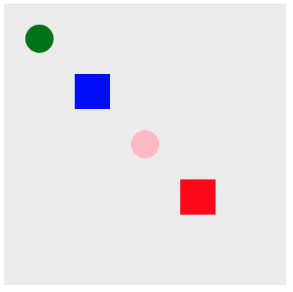
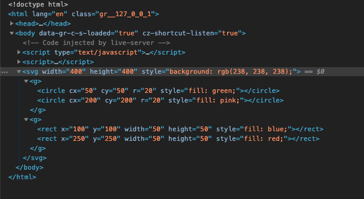
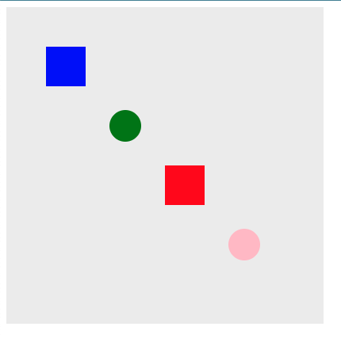

# Group Element

D3 에서 Group 엘리먼트는 SVG 엘리먼트들을 논리적 단위로 묶어주는 컨테이너 역할을 합니다.

-   SVG 엘리먼트를 서로 묶어서 그룹을 만들어 줍니다.
-   그룹으로 일단 지정하면, 그룹 하위의 모든 컨테이너에 포함된 엘리먼트가 됩니다.
-   그룹은 <g> ... </g> 으로 묶어줄 수 있습니다.
-   Group 엘리먼트들은 자식으로 여러 그룹을 가질 수 있습니다.

## 엘리먼트 그룹 짓기.

기본 엘리먼트는 아래와 같다고 생각해 보겠습니다.

둥근원, 사각형 번갈아 가면서 아래와 같이 그려보았습니다.

### 기본 엘리먼트 그려주기

```
	<script>
		var svg = d3
			.select("body")
			.append("svg")
			.attr("width", 400)
			.attr("height", 400)
			.style("background", "#eeeeee");

		svg.append("circle")
			.attr("cx", 50)
			.attr("cy", 50)
			.attr("r", 20)
			.style("fill", "green");

		svg.append("circle")
			.attr("cx", 200)
			.attr("cy", 200)
			.attr("r", 20)
			.style("fill", "pink");

		svg.append("rect")
			.attr("x", 100)
			.attr("y", 100)
			.attr("width", 50)
			.attr("height", 50)
			.style("fill", "blue");

		svg.append("rect")
			.attr("x", 250)
			.attr("y", 250)
			.attr("width", 50)
			.attr("height", 50)
			.style("fill", "red");
	</script>
```



### 그룹 지어주기

이번에는 그룹을 만들어 보겠습니다. 첫번재, 두번째 원을 첫번째 그룹으로

그리고 세번째, 네번째 사각형을 두번째 그룹으로 만들어 주겠습니다.

```
	<script>
		var svg = d3
			.select("body")
			.append("svg")
			.attr("width", 400)
			.attr("height", 400)
			.style("background", "#eeeeee");

		var firstGroup = svg.append("g");

		firstGroup
			.append("circle")
			.attr("cx", 50)
			.attr("cy", 50)
			.attr("r", 20)
			.style("fill", "green");

		firstGroup
			.append("circle")
			.attr("cx", 200)
			.attr("cy", 200)
			.attr("r", 20)
			.style("fill", "pink");

		var secondGroup = svg.append("g");

		secondGroup
			.append("rect")
			.attr("x", 100)
			.attr("y", 100)
			.attr("width", 50)
			.attr("height", 50)
			.style("fill", "blue");

		secondGroup
			.append("rect")
			.attr("x", 250)
			.attr("y", 250)
			.attr("width", 50)
			.attr("height", 50)
			.style("fill", "red");
	</script>
```

위 소스를 살펴보면 우리는 firstGroup 변수를 하나 만들고 svg 에 append 하였습니다.

그리고 firstGroup 에 원을 그려주었습니다.

두번째 그룹인 secondGroup도 동일하게 잡아주었습니다.

그룹을 지어 준다고 해서 달라지는 것은 없습니다. 다만 dom 이 달라졌습니다.

아래 svg 엘리먼트 아래 2개의 그룹이 추가되어 있음을 확인할 수 있습니다.



## Group 이점 알아보기.

그룹 이점은 만약 각 도형들의 위치를 이동하고자 할때, 일일이 엘리먼트의 속성값을 추가해 주어야합니다.

그러나 그룹을 지정하고, 그룹을 이동하게 된다면 한꺼번에 전체 그룹이 이동합니다.

```
	<script>
		var svg = d3
			.select("body")
			.append("svg")
			.attr("width", 400)
			.attr("height", 400)
			.style("background", "#eeeeee");

		var firstGroup = svg
			.append("g")
			.attr("transform", `translate(100, 100)`);

		firstGroup
			.append("circle")
			.attr("cx", 50)
			.attr("cy", 50)
			.attr("r", 20)
			.style("fill", "green");

		firstGroup
			.append("circle")
			.attr("cx", 200)
			.attr("cy", 200)
			.attr("r", 20)
			.style("fill", "pink");

		var secondGroup = svg
			.append("g")
			.attr("transform", `translate(-50, -50)`);

		secondGroup
			.append("rect")
			.attr("x", 100)
			.attr("y", 100)
			.attr("width", 50)
			.attr("height", 50)
			.style("fill", "blue");

		secondGroup
			.append("rect")
			.attr("x", 250)
			.attr("y", 250)
			.attr("width", 50)
			.attr("height", 50)
			.style("fill", "red");
	</script>
```

우선 첫번째 그룹은 첫번재, 세번째 원을 가지고 있습니다.

원들을 그룹으로 묶었고, 그룹의 위치를 가로 100, 세로 100 위치로 이동했습니다.

```
		var firstGroup = svg
			.append("g")
			.attr("transform", `translate(100, 100)`);
```

그리고 다음으로 두번째 그룹의 위치를 가로 -50, 세로 -50 위치로 이동하겠습니다.

```
		var secondGroup = svg
			.append("g")
			.attr("transform", `translate(-50, -50)`);
```

결과를 확인해보면 사각형과 원의 위치가 바뀌어 있음을 알 수 있습니다 .



# 결론 

그룹은 위 에제로 확인한 것과 같이 엘리먼트 들을 묶어주고, 해당 엘리먼트들에 대한 속성변경을 수행할 수 있도록 해주는 매우 유용한 기능입니다. 

차트를 그리는 경우를 생각해보면 가로, 높이 축을 그룹으로 묶어줄 수 있습니다. 

그리고 제목 부분, 차트가 그려지는 부분, 범례 등을 그룹으로 묶어두면, 자유자재로 속성값을 활용하여 변화를 줄 수 있습니다. 

