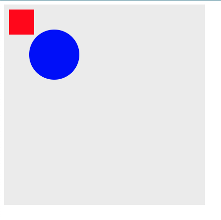
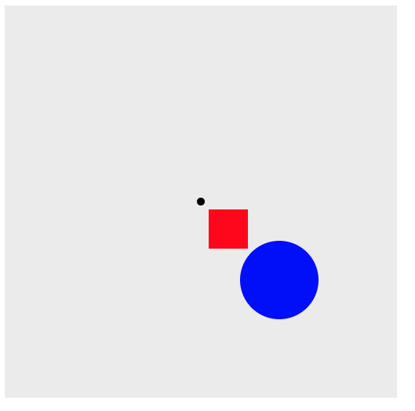

# D3 Transform 알아보기

D3 에서 트랜스폼은 SVG 엘리먼트에 변형을 가하는 행위를 할 수 있습니다. Transform 은 attr 을 통해서 속성으로 지정할 수 있으며 변화를 줄 수 있는 메소드는 다음과 같습니다

-   matrix(a, b, c, d, e, f): 이 변환은 6개의 값을 가진 매트릭스에 의해서 특정 변환을 수행할 수 있습니다.
-   translate(x, [y]): 이 변환은 x와 y위치로 위치 이동을 지정된 값으로 수행합니다. x 값은 필수이며, y값이 없다면 0으로 설정됩니다.
-   rotate(degree): 지정된 각도로 회전합니다. cx, cy 를 지정하면 해당 축을 기준으로 회전을 합니다.
-   scale(x, [y]): 이 변환은 x와 y값에 따라서 스케일 오퍼레이션을 지정합니다. 만약 y가 지정되지 않았다면 x와 동일하게 설정됩니다.
-   skewX(a): 이 변환은 지정된 skew 변환을 x 축에 의해서 각도에 따라 설정됩니다.
-   skewY(a): 이 변환은 지정된 skew 변환을 y 축에 의해서 각도에 따라 설정됩니다.

## 기본 html 작성하기.

```
	<script>
		var svg = d3
			.select("body")
			.append("svg")
			.attr("width", 400)
			.attr("height", 400)
			.attr("background", "#eeeeee");

		var group = svg.append("g");

		group
			.append("rect")
			.attr("x", 10)
			.attr("y", 10)
			.attr("width", 50)
			.attr("height", 50)
			.attr("fill", "red");

		group
			.append("circle")
			.attr("cx", 100)
			.attr("cy", 100)
			.attr("r", 50)
			.attr("fill", "blue");

	</script>
```

우선 기본적인 그룹을 잡고, 사각형과 원을 그려줍니다.



## 위치 이동하기.

translate 는 위치 이동을 수행할 수 있도록 합니다.

x 축으로 100, y 축으로 100 으로 이동합니다.

```
	<script>
		var svg = d3
			.select("body")
			.append("svg")
			.attr("width", 400)
			.attr("height", 400)
			.style("background", "#eeeeee");

		var group = svg.append("g");

		group
			.append("rect")
			.attr("x", 10)
			.attr("y", 10)
			.attr("width", 50)
			.attr("height", 50)
			.attr("fill", "red");

		group
			.append("circle")
			.attr("cx", 100)
			.attr("cy", 100)
			.attr("r", 50)
			.attr("fill", "blue");

		group.attr("transform", "translate(" + 100 + ", " + 100 + ")");
	</script>
```

달라진 부분은 transform 속성에 translate 를 지정했습니다. 처음 값은 x, 두번째 값은 y 축입니다.


## Rotate 는 지정된 위치를 기반으로 특정 각도로 이동 시킨다.

```
	<script>
		var svg = d3
			.select("body")
			.append("svg")
			.attr("width", 500)
			.attr("height", 500)
			.style("background", "#eeeeee");

		svg.append("g")
			.append("circle")
			.attr("cx", 250)
			.attr("cy", 250)
			.attr("r", 5);
		var group = svg.append("g");

		group
			.append("rect")
			.attr("x", 10)
			.attr("y", 10)
			.attr("width", 50)
			.attr("height", 50)
			.attr("fill", "red");

		group
			.append("circle")
			.attr("cx", 100)
			.attr("cy", 100)
			.attr("r", 50)
			.attr("fill", "blue");

		group.attr(
			"transform",
			"translate(" + 250 + ", " + 250 + ") rotate(0)"
		);
	</script>
```

우선 가운데 점을 하나 만들었습니다.

이는 별개의 그룹으로 지정했습니다. 그리고 사각형, 원을 추가하였습니다.

### rotate(0)



### rotate(45)


### rotate(90)


## Scale

```
	<script>
		var svg = d3
			.select("body")
			.append("svg")
			.attr("width", 500)
			.attr("height", 500)
			.style("background", "#eeeeee");

		svg.append("g")
			.append("circle")
			.attr("cx", 250)
			.attr("cy", 250)
			.attr("r", 5);
		var group = svg.append("g");

		group
			.append("rect")
			.attr("x", 10)
			.attr("y", 10)
			.attr("width", 50)
			.attr("height", 50)
			.attr("fill", "red");

		group
			.append("circle")
			.attr("cx", 100)
			.attr("cy", 100)
			.attr("r", 50)
			.attr("fill", "blue");

		group.attr("transform", "translate(" + 250 + ", " + 250 + ") scale(2)");
	</script>
```

scale(2) 를 이용하여 현재 도형의 2배 큰 도형을그려줍니다.

이 설정은 group 이름된 그룹에만 지정할 수 있습니다.

### scale(2)


### scale(0.5)


## SkewX 

Skew 샘플을 살펴보겠습니다. 

```
	<script>
		var svg = d3
			.select("body")
			.append("svg")
			.attr("width", 500)
			.attr("height", 500)
			.style("background", "#eeeeee");

		svg.append("g")
			.append("circle")
			.attr("cx", 250)
			.attr("cy", 250)
			.attr("r", 5);
		var group = svg.append("g");

		group
			.append("rect")
			.attr("x", 10)
			.attr("y", 10)
			.attr("width", 50)
			.attr("height", 50)
			.attr("fill", "red");

		group
			.append("circle")
			.attr("cx", 100)
			.attr("cy", 100)
			.attr("r", 50)
			.attr("fill", "blue");

		group.attr(
			"transform",
			"translate(" + 250 + ", " + 250 + ") skewX(50)"
		);
	</script>
```


# 결론 

지금까지 기본적인 d3 의 transform 에 대해서 알아보았습니다. 

확대/축소 회전 이동등 기본적인 사항들에 대해서 알아 보았습니다. 

matrix 의 경우에는 다음에서 [샘플](https://bl.ocks.org/helderdarocha/8b28505082bf1c81977d7dec797686c7)을 살펴보시면 이해가 되실 것입니다. 

