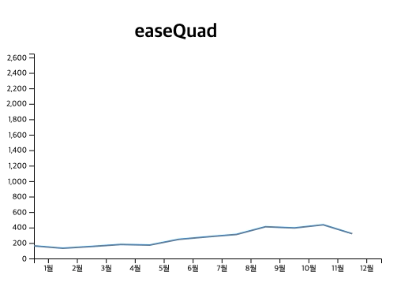

# D3 Transition 

Transition 은 특정 도형이나 물체의 변화에 대해서 지정된 시간동안 변화를 보여주는 기법입니다. 

D3 에서는 transition 이라는 함수를 이용하여 다양한 변화를 줄 수 있습니다. 

이번 아티클에서는 어떠한 변환이 있는지 그리고 어떻게 사용할 수 있는지 알아 보겠습니다. 

일단 transition 을 주기 위해서는 selection 을 해야합니다. 그리고 셀렉션 된 물체에 대해서 전이를 발생시킵이다. 

## Basic Transition 

```
  <script>
      d3.select("body")
        .style("background", "green")
        .transition()
        .duration(5000)
        .style("background", "blue");
  </script>
```

가장 단순한 예로 body 의 배경색을 녹색에서 파란색으로 서서히 변화 시키는 예제입니다. 

style("background", "green") 이 시작 값이되고 이후, transition() 을 설정하면 트랜지션이 걸립니다. 

그리고나서 duration 을 통해서 얼마의 시간동안 트랜지션이 발생될지 지정합니다. 밀리세컨 단위로 설정합니다. 

그리고 최종적으로 .style("background", "blue") 로 배경색상이 파란색이 됩니다. 

## 개체 이동 트랜지션

```
  <script>
    var width = 500;
    var height = 500;

    var svg = d3
      .select("body")
      .append("svg")
      .attr("width", width)
      .attr("height", height)
      .style("background", "#eeeeee");

    var circle = svg
      .append("circle")
      .attr("cx", 50)
      .attr("cy", 50)
      .attr("r", 10)
      .attr("fill", "red");

    circle
      .transition()
      .duration(2000)
      .attr("cx", 420)
      .attr("cy", 420)
      .attr("r", 50);
  </script>
```

위 예제를 보면 500 * 500 svg 영역에서 반지름 10 짜리 원을 그립니다. 

그리고 트랜지션을 이용하여 2초에 걸쳐서 위치는 420, 420 으로 이동하고, 반지름의 크기는 50으로 지정하였습니다. 

이렇게 되면 자연적으로 처음 위치에서 점점 원이 커지면서 목표 지점으로 이동합니다. 

## 트랜지션 체이닝

트랜지션을 순서대로 체이닝을 걸어서 수행할 수 있습니다. 

위 예제를 이동먼저 하고, 이후에 크기를 변화시켜 봅시다. 

```
  <script>
    var width = 500;
    var height = 500;

    var svg = d3
      .select("body")
      .append("svg")
      .attr("width", width)
      .attr("height", height)
      .style("background", "#eeeeee");

    var circle = svg
      .append("circle")
      .attr("cx", 50)
      .attr("cy", 50)
      .attr("r", 10)
      .attr("fill", "red");

    circle
      .transition()
      .duration(2000)
      .attr("cx", 420)
      .attr("cy", 420)
      .transition()
      .delay(1000)
      .duration(2000)
      .attr("r", 50);
  </script>
```

달라진 부분은 목적지 위치로 420, 420 만큼 이동시킨 이후 다시 transition() 체이닝을 걸어줍니다. 

그리고 delay 메소드를 이용하여 1초동안 정지합니다. 

그리고나서 2초에 걸쳐서 원의 반지름 50까지 크기를 늘입니다. 

## 조금더 쓸만하게 적용하기. 

이번에는 라인 차트를 트랜지션을 이요앟여 약간의 변화를 주겠습니다. 

```
	<script>
		var datas = [
			{ date: "1월", sales: 1000 },
			{ date: "2월", sales: 800 },
			{ date: "3월", sales: 950 },
			{ date: "4월", sales: 1100 },
			{ date: "5월", sales: 1050 },
			{ date: "6월", sales: 1500 },
			{ date: "7월", sales: 1700 },
			{ date: "8월", sales: 1900 },
			{ date: "9월", sales: 2500 },
			{ date: "10월", sales: 2400 },
			{ date: "11월", sales: 2650 },
			{ date: "12월", sales: 1950 }
		];

		var title = "월별 판매지수 라인차트";
		var titleGap = 50;
		var margin = (margin = { top: 20, right: 20, bottom: 70, left: 40 });
		var width = 500 - margin.left - margin.right,
			height = 400 - margin.top - margin.bottom - titleGap;

		const peopleArray = Object.keys(datas).map(i => datas[i].date);
		var xScale = d3
			.scaleBand()
			.domain(peopleArray)
			.range([0, width]);
		var yScale = d3
			.scaleLinear()
			.domain([d3.max(datas, d => d.sales), 0])
			.range([0, height]);

		var svg = d3
			.select("body")
			.append("svg")
			.attr("width", width + margin.left + margin.right)
			.attr("height", height + margin.top + margin.bottom + titleGap)
			.append("g")
			.attr(
				"transform",
				"translate(" + margin.left + "," + (margin.top + titleGap) + ")"
			);

		var xAxis = d3.axisBottom().scale(xScale);

		svg.append("g")
			.attr("transform", "translate(0," + height + ")")
			.call(xAxis)

		var yAxis = d3.axisLeft().scale(yScale);
		svg.append("g")
			.call(yAxis)

		var line = d3.line()
			.x( (d, i) => xScale(d.date) )
			.y( height );

		var linePath = svg.append("path")
			.datum(datas)
			.attr("class", "line")
			.attr("fill", "none")
			.attr("stroke", "steelblue")
			.attr("stroke-width", 2)
			.attr("d", line)
			;

		var line2 = d3.line()
			.x( (d, i) => xScale(d.date) )
			.y( (d, i) => yScale(d.sales) );

		var trans = svg.transition().duration(3000);
		trans.selectAll(".line")
			.attr("d", line2)

		d3.select("body svg")
			.append("g")
			.attr("transform", `translate(${width / 2} , 50)`)
			.append("text")
			.attr("font-size", 24)
			.attr("font-weight", "bold")
			.attr("text-anchor", "middle")
			.text(title);
	</script>
```
기본적인 라인 차트를 그려주기 위해서 라인 객체를 하나 만듭니다. 

```
		var line = d3.line()
			.x( (d, i) => xScale(d.date) )
			.y( height );
```

이렇게 하면 아래 X 축에 깔리는 라인이 생성이 될 것입니다. y 값이 x 축에 존재하는 것이므로, 직선 라인이 되겠죠? 

그리고 직선 라인을 다음과 같이 그려줍니다. 

```
		var linePath = svg.append("path")
			.datum(datas)
			.attr("class", "line")
			.attr("fill", "none")
			.attr("stroke", "steelblue")
			.attr("stroke-width", 2)
			.attr("d", line)
			;
```

이렇게 일반적인 라인을 그려 줍니다. 

이제 변경을가할 새로운 라인을 생성하고, 트랜지션으로 라인을 다시 그려줍니다. 

```
		var line2 = d3.line()
			.x( (d, i) => xScale(d.date) )
			.y( (d, i) => yScale(d.sales) );

		var trans = svg.transition().duration(3000);

		trans.selectAll(".line")
			.attr("d", line2)
```

line2 는 각 값을 스케일링해서 화면에 라인을 그려주도록 패스를 생성해 냅니다. 

그리고 trans 를 이용하여 트랜지션을 약 3초간 발생 시킵니다. 

트랜지션을 svg 에 걸었으므로 svg 내에서 .line 클래스를 찾아냅니다. 

그리고 attr("d", line2) 를 통해서 X 축 바닥에 깔린 라인이 천천히 올라 오면서 라인이 그려집니다. 


## Ease

Ease 는 트랜지션에 이펙트를 주는 것을 이야기 합니다. 

- easeElastic
- easeBounce
- easeLinear
- easeSin
- easeQuad
- easeCubic
- easePoly
- easeCircle
- easeExp
- easeBack

easy 에 대한 매우 자세한 샘플은 [easy](https://bl.ocks.org/d3noob/1ea51d03775b9650e8dfd03474e202fe) 에서 확인하시면 이해가 쉽습니다. 

### easyElastic


### easyBounce


### easeLinear


### easeSin


### easeQuad



### easeCubic


### easyPoly


### easeCircle


### easeExp


### easeBack


# 결론

지금까지 트랜지션에 대해서 살펴 보았습니다. 

트랜지션을 어떻게 사용하는지를 알아봤고, ease 에 대해서도 알아보았습니다. 


